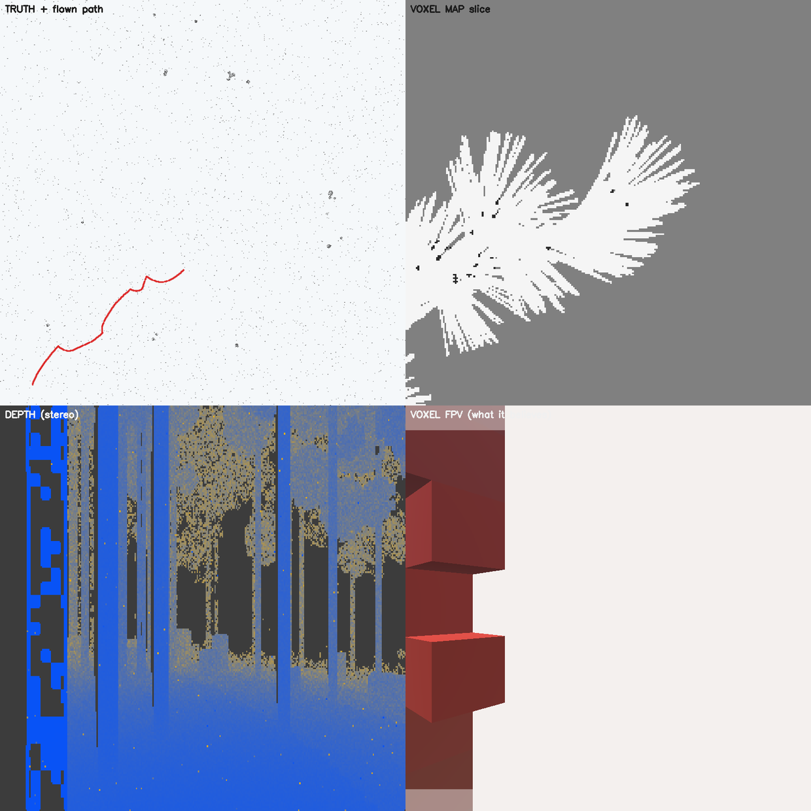
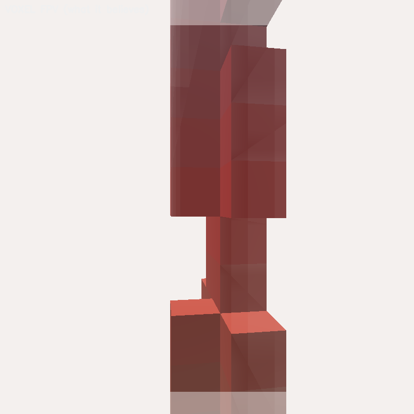
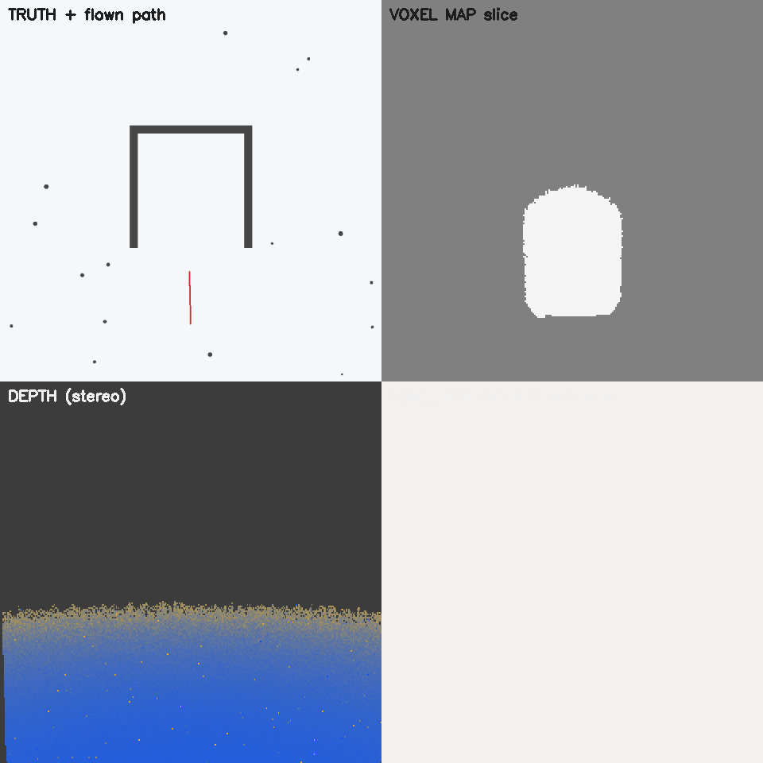
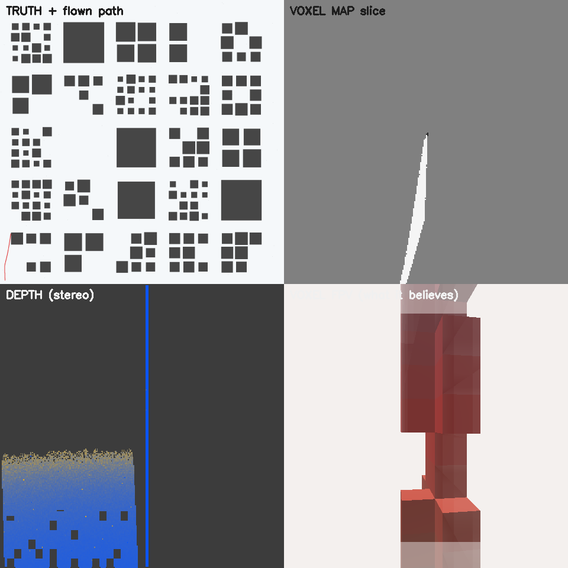
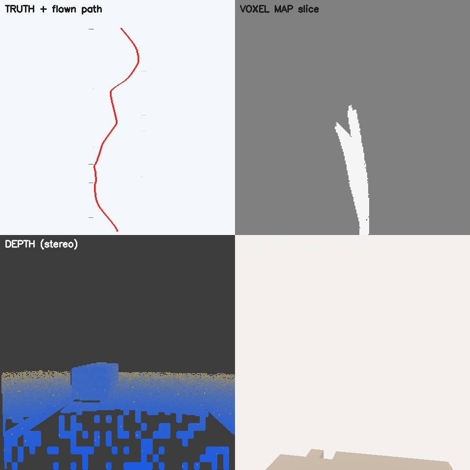
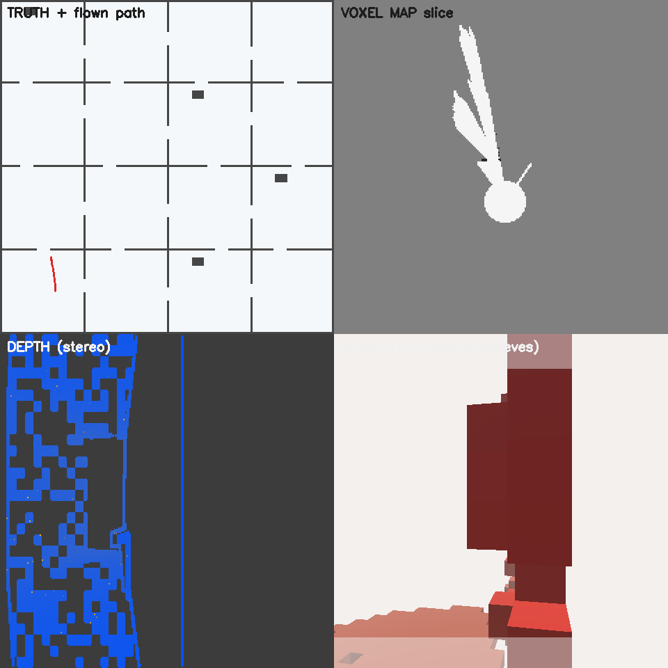

# Kestrel — project brief

*A companion-computer autonomy stack for a cheap analog FPV quadcopter.
Raspberry Pi 5, CPU only, no GPU, no ROS, no GNSS.*

**Written 2026-08-26.** This file supersedes the hardware sections of
`PROJECT.md`, which describe an earlier sensor plan. For the reasoning behind
each choice see `ARCHITECTURE.md`; for the running lab notebook — including
every hypothesis that measurement killed — see `NOTES.md`.

Throughout, claims are tagged:

* *(measured)* — a number behind it, produced by a run in this repo.
* *(code)* — read from source. Records what was written, not what worked.
* *(asserted)* — believed, not yet tested. Treat as a hypothesis.

---

## 1. The thesis

A £400 analog FPV quadcopter already flies well. It has an attitude controller
that works, a pilot who can fly it, and a video link. What it cannot do is
*decide where to go* when the radio link is jammed and the satellite fix is
gone.

The bet is that this is a **perception and planning** problem, not a compute
problem — that a Raspberry Pi 5 with no GPU is enough, provided you are honest
about what the sensor can actually measure and you never let the system act on
a belief it has not earned.

Everything downstream follows from that second clause.

---

## 2. The aircraft

The autonomy stack bolts onto an ordinary analog quad. Nothing about the
airframe is special-cased for it — deliberately, because a design that needs a
custom airframe is a design that nobody else can reproduce.

### Current build

| Component | Part | Notes |
|---|---|---|
| Frame | MK4, 7" generic | |
| Flight controller | Matek H743-SLIM V4 | No onboard compass — heading comes from the GPS module |
| Firmware | **iNAV** | ArduPilot planned; the stack targets ArduPilot, so this is a migration still to do |
| ESC | 4-in-1, 60 A (BLS) | |
| Motors | 2207, 1850 KV ×4 | |
| Propellers | 7043 (7 × 4.3) | ~200 Hz fundamental at cruise — the number the camera mount has to survive |
| FPV camera | Caddx analog | Custom wiring |
| VTX | Analog | Custom wiring |
| GPS | M100 | Carried, logged, **routed nowhere in the flight path** — see §7 |
| Optical flow | **not fitted** | FC-side flow (e.g. PMW3901 + ToF) would give iNAV/ArduPilot native GNSS-denied position hold. Open item. |
| Battery | *not recorded here* | Fill in before this doc is used as a build reference |

### Companion computer

| Component | Role |
|---|---|
| Raspberry Pi 5 (4 GB) | Runs the whole stack: perception, mapping, planning, the FC link |
| Intel RealSense D435i | Stereo depth + IR + IMU. **The primary sensor.** |
| USB CVBS capture dongle | Taps the *existing* analog video feed as a second listener |

**The analog tap is worth a sentence of its own.** The Pi does not have its own
FPV camera. An €8 capture dongle reads the same composite signal already
running from the FPV camera to the VTX. The pilot's path — camera → VTX → air →
goggles — stays purely analog and untouched, so the autonomy side adds **zero
latency to what the pilot sees**. That is the concrete answer to "how do you use
an analog FPV feed for autonomy": you don't digitize the aircraft, you tap the
one signal that already exists.

### Where the D435i actually is right now

**Handheld and bench only.** It has never flown. Every real-world depth capture
in this repo was taken by hand. That is the single largest gap between what is
validated and what is claimed, and §9 says so plainly.

---

## 3. What the sensor can honestly measure

This is the number the entire architecture is built around.

The D435i has a **50 mm baseline** and `fx ≈ 447` at 848×480. For a voxel of
edge `c` to be *honest* — for the range error along the ray to be smaller than
the cell you are writing into — you need

```
Z_max = √(c · f · B / σ_d) × 0.75
```

At `c = 0.25 m` and an assumed `σ_d = 0.25 px`, that is **3.54 m** *(measured)*.

Past 3.54 m the depth image still contains information, but not information at
voxel resolution. The range error along the ray grows as

```
δZ = Z² · σ_d / (f · B)
```

while the error *across* the ray grows only linearly. Their ratio is `Z·σ/B` —
**10:1 at 2 m, 100:1 at 20 m** *(measured)*. A cube must be sized for the worse
of the two, so a voxel honest in range at 20 m would be 8 m wide and would throw
away the 4.5 cm of lateral detail the sensor still has.

**Hence the load-bearing decision of the project: cubes near, bearings far.**

---

## 4. Architecture

```
   analog FPV camera ──► USB capture ──┐
                                       ├──► frame
   D435i (depth + IR + IMU) ───────────┘      │
                                              ▼
              ┌───────────────── PERCEPTION ─────────────────┐
              │  NEAR: VoxelMap          FAR: BearingField   │
              │  0.25 m cells            360 az × 48 el      │
              │  3-state log-odds        1° bins             │
              │  honest to 3.54 m        nearest confident   │
              │  MAY VETO                MAY ONLY ADVISE     │
              └────────┬──────────────────────┬──────────────┘
                       │                      │
                       ▼                      ▼
           ┌─── TrajectoryPlanner ───┐  ┌── OBSTACLE_DISTANCE ──┐
           │ 210 body-frame          │  │  72 bins → ArduPilot  │
           │ primitives + sphereClear│  │  independent avoidance│
           └──────────┬──────────────┘  └───────────────────────┘
                      │  bearing + speed
                      ▼
           ┌─── WorldState blackboard ───┐
           │  latch + stamp + Fresh()    │
           └──────────┬──────────────────┘
                      ▼
           ┌─── FcLink (own thread) ─────┐
           │ SET_ATTITUDE_TARGET         │
           │ stale command → NEUTRAL     │
           └──────────┬──────────────────┘
                      ▼
              ArduPilot (attitude + rate control)
```

### 4.1 Authority asymmetry

The near field and the far field are **not equal partners**. `sphereClear`
hard-rejects any primitive whose swept 0.6 m ball touches an OCCUPIED cell, so
one invented near cell deletes a manoeuvre. An invented far bearing costs only a
bad openness score.

> **Inventing awareness is cheap; inventing permission is not.**

That asymmetry is the reason a learned model is admissible in the far field and
nowhere else (`FAR_FIELD_MODELS.md`), and it is the reason the near map is
three-state.

### 4.2 Unknown is not free

`VoxelMap` distinguishes FREE, OCCUPIED and **UNKNOWN**. Two-state occupancy
grids cannot express "I have not looked there", so they answer "is this tube
clear?" with "yes" for space they have never observed.

This bug was real, not theoretical. The planner scored an unobserved direction
as maximally open, and the consequence was that **it wanted to fly straight up**
— the sky is the direction with the fewest returns, so on a two-state reading it
is the most attractive direction in the world. The fix:

```cpp
const float r = far->field->rangeAt(endAz, endEl);
farOpen = (r < 0.f) ? 0.f                              // unknown scores ZERO
                    : std::min(r, far->rangeM) / std::max(0.1f, far->rangeM);
```

Plus a symmetric climb/descent penalty charged relative to the *commanded*
elevation, not to level flight — a one-sided penalty simply inverts the bias and
the aircraft dives instead *(measured: max descent went 0.10 → 0.80 m before the
symmetry was restored)*.

### 4.3 Who estimates position: nobody

Three architectures were considered for the FC↔Pi link:

| | who estimates position | Pi sends | verdict |
|---|---|---|---|
| A | the Pi; the FC consumes it | synthetic GPS / vision pose | **retired** — double filtering |
| B | the FC; the Pi sends measurements | odometry increments + covariance | right for v2 |
| **C** | **nobody** | body-frame attitude commands | **right for v1** |

Under A, EKF3 receives an already-filtered Pi estimate and treats it as an
independent measurement: two filters in series, neither aware of the other, and
a covariance that means nothing. Architecture C avoids this by not producing a
position at all — the planner is body-frame by construction, the map is local
and short-lived, and the output is a bearing and a speed.

**The consequence that will bite on a field day, stated rather than
discovered:** GUIDED velocity setpoints require a horizontal velocity estimate,
and GNSS-denied there isn't one. So the planner's speed is expressed as a
**pitch angle** via `SET_ATTITUDE_TARGET`. Crude, and correct for the
constraint.

### 4.4 The free defence in depth

`BearingField::obstacleDistance()` emits ArduPilot's `OBSTACLE_DISTANCE` (msg
330): 72 distances by bearing, bin 0 at the nose, 65535 as the no-data sentinel
*(code, test-pinned)*. Publishing it buys **a second, independent avoidance
layer running inside ArduPilot** — different code, different failure modes, no
dependence on our planner.

For a project whose safety argument rests on independent paths to a veto, that
is close to free.

---

## 5. The planner, and what the comparison actually showed

Two planners were compared head to head across **6 worlds × 8 seeds, paired**
*(measured)*:

* **Trajectory planner** — 210 precomputed body-frame primitives, each rolled
  out and swept-volume checked: *"is this entire 2 s arc clear, 0.6 m ball at
  every point?"*
* **Histogram planner** — VFH-style angular openness: *"does this bearing look
  open?"*

### The uncomfortable result

The histogram planner **wins progress in all six worlds, significantly** —
paired |t| from 2.76 to 17.71, with the trajectory planner winning 0 or 1 of 8
seeds everywhere.

### Why that reading was wrong

The trajectory planner does not stop because it is **blocked**. It stops because
it is **throttled**: 195–207 of 210 primitives reject on *genuinely mapped*
OCCUPIED cells, `freeM` correctly near zero, speed correctly zero. Indoors the
rollout is simply **longer than the room**.

**The histogram planner never stops because it never asks for a tube.** It
steers. It is checking *less*, and that is the whole of its advantage.

And where the extra check matters, it shows up:

| world | clearance Δ (traj − hist) | \|t\| | traj wins |
|---|---|---|---|
| forest | +0.035 m | 0.34 | 1/8 |
| lanes | +0.110 m | 1.28 | 5/8 |
| city | −0.016 m | 0.08 | 3/8 |
| road | −0.101 m | 1.49 | 2/8 |
| **indoor** | **+0.120 m** | **3.41** | **7/8** |
| **culdesac** | **+0.605 m** | **3.69** | **6/8** |

Indoor and cul-de-sac are the two genuinely *enclosed* worlds. The trajectory
planner's conservatism is correctly targeted and always paid for: 0.6 m more
clearance in a cul-de-sac, 3 cm more in a forest for half the distance
travelled.

Collisions: **1 in 96 runs**. Compute: the trajectory planner is **2–3× cheaper**
(2.2 ms vs 7.1 ms in forest) — its header's cost claim holds up even where its
quality claim does not.

**Neither planner is retired.** The measurement changed what each one is *for*,
not which one survives.

### A correction worth recording

Mid-run I claimed from n=3 that the far-field term was hurting the planner.
At n=48 it is the opposite sign: turning the far field off improves progress
everywhere and cuts stopping sharply — but in the city it produced **two
collisions where the far field on produced none**, plus a significant clearance
loss in the cul-de-sac. The far field is not a defect; it is buying safety with
progress, the same trade the whole planner makes.

*I called it a bug on three samples and it looks like a safety feature on
forty-eight.* That pattern — an early reading reversing under n — recurs often
enough in `NOTES.md` to be a working rule.

---

## 6. Pictures

### 6.1 Real data — `voxel_live`, indoor corridor, D435i handheld


The only real-sensor capture in this document. Four panes: measured depth
(85.1 % valid), the first-person render of the aircraft's own voxel map, the map
slice, and the plan pane.

Two things it shows, both by design:

1. **Pale is UNKNOWN, drawn as fog and not as air.** The white void ahead is not
   open space — it is space that has not been observed. Rendering it as fog
   rather than as emptiness is the visual form of the same rule the planner
   enforces.
2. **`0 admissible … BLOCKED`, commanded speed 0.00 m/s.** Faced with a map it
   has not earned, the correct output is to stop. It stops.

Integrate 10.6 ms, plan 0.37 ms.

### 6.2 Reference plate — how to read these views

Every simulated view below is the same four panes in the same places.



| pane | what it is | who can see it |
|---|---|---|
| top left | **Truth + flown path** — the world as it actually is, and where the aircraft went | the scorer only; *never* the planner |
| top right | **Voxel map slice** — a horizontal cut through what has been mapped. White is observed free, grey is UNKNOWN, dark specks are occupied | the planner |
| bottom left | **Depth (stereo)** — the simulated D435i frame. Blue near, sand far, dark is no return | perception |
| bottom right | **Voxel FPV** — the aircraft's own first-person render of its map. Red is occupied, pale is unknown drawn as fog | **the only pane the planner can see** |

The split between the top-left and bottom-right panes is the whole point of the
harness. The aircraft plans against its own noisy map; collisions are scored
against `VoxelWorld`. **They are different data structures on purpose** — a
harness that checked the plan against the map it planned with would pass no
matter how wrong the map was.

Here is that bottom-right pane on its own, at full size — a building corner in
the city world, which shows it more legibly than the forest plate above:



Red cubes are voxels the aircraft has *measured* and marked occupied. Everything
pale is UNKNOWN — not empty, **unobserved**. The planner may fly into neither,
and that is the difference between this and a two-state grid, which would render
the entire pale region as open air and steer straight into it.

### 6.3 Simulated worlds

Each is the same four-pane view described above.

**Forest** — the design case. Trunks, canopy, undergrowth.


Note the map slice: carved free space fans out in rays from the flown path, and
everything else stays grey. The aircraft has mapped a corridor, not a forest.

**Cul-de-sac** — the trap. The straight line to the goal runs into a closed
pocket; escaping means abandoning the goal bearing.



This is the clearest single illustration of three-state occupancy. The white
blob in the slice is everything observed so far. The pocket walls are visible in
ground truth and **absent from the map**, because they have not been seen yet —
and the planner is not permitted to assume they are not there.

**City** — building blocks, street canyons.



**Road** — kerbs, lamp posts, 8 cm catenary wire, signs, vehicles.



The first-person pane is nearly empty, and that is the honest answer rather than
a rendering fault: on an open road almost nothing is inside 3.54 m, so there is
almost nothing the near map is entitled to write down. The aircraft is steering
on the far field and on the strip of ground it can actually measure.

**Indoor** — rooms, doorways cut as real geometry, 2.4 m ceiling, built at 0.05 m
truth resolution because a 0.12 m wall and a 0.9 m door do not exist at 0.25 m.



A 0.6 m-radius aircraft cannot pass a 0.9 m door — 1.2 m of diameter through
0.9 m of opening — so indoors defaults to a smaller airframe. The world exists to
make that constraint concrete rather than arguable.

---

## 7. GNSS exclusion is checkable, not a promise

The M100 is fitted and powered. `GPS_RAW_INT` is received and written to the
black box. It is **routed nowhere else** — one grep proves it.

Under architecture C the claim is stronger still: there is no position estimate
anywhere in the flight path for GNSS to contaminate. `EK3_SRC*` is logged per
flight and never set to GPS.

---

## 8. Motion estimation, and why it needs two sensors

The D435i has an IMU. It does **not** compute optical flow — the D4 ASIC does
stereo matching and nothing else. What the camera gives you is two *rectified*
IR streams plus per-pixel depth from the same instant, which removes the two
hard parts of computing flow yourself.

**Short-memory inertial odometry** (`imu_odometry.hpp`) integrates accelerometer
data between zero-velocity updates and declares itself invalid once predicted
drift exceeds a budget. Predicted drift is dominated by attitude error, not
sensor noise:

```
drift ≈ ½ · g·sin(θ_err) · t²
```

**Measured, it fails at every tilt error tested**: the legs the planner actually
flies are 3.70 s against a 1.71 s budget at 1° of attitude error. Inertial error
grows as t²; velocity-measured error grows as t¹. No better IMU fixes that — only
a velocity measurement does.

**Flow × depth → metric velocity** (`flow_velocity.hpp/.cpp`) supplies it. Sparse
grid match on the IR stream, forward-backward gated, de-rotated with the FC
attitude, scaled by per-point depth, 3×3 least squares.

Fused, *(measured)*: **4.1× mean and 6.9× worst-case improvement** over IMU
alone. And the interesting part — **flow *quality* barely matters** (5 % vs 15 %
noise moved the result 22 %) while flow *presence* matters enormously. The
question is not "how good is the flow", it is "is there any flow at all".

The estimator's most important property is its failure mode: a textureless wall
yields **no estimate**, not a confident zero *(measured: 0 points survive)*. A
confident zero is what kills you — the odometry believes it is stationary and
integrates its own drift as truth.

---

## 9. Status: what is real, what is not

### Built and measured

* `VoxelMap` — 3-state multi-resolution occupancy, 6.8–9.6 ms *(measured)*
* `BearingField` — 360×48 angular openness, 2.5 ms, yaw as an exact index shift
* `TrajectoryPlanner` + `sphereClear`, 2.2 ms forest
* Histogram planner, retained
* MAVLink v2 codec, pinned against pymavlink golden frames
* `ATTITUDE`, `HEARTBEAT`, `RC_CHANNELS`, `SYS_STATUS`, `EKF_STATUS_REPORT`,
  `GPS_RAW_INT` decoders
* `SET_ATTITUDE_TARGET` uplink — refuses to send without a fresh attitude rather
  than guessing a heading
* `OBSTACLE_DISTANCE` producer
* IMU odometry with ZUPT + velocity update
* Flow → metric velocity
* Six simulated worlds; 12 nav-sim + 13 onboard ctest targets, all passing

### Not done

1. **Nothing in this project has ever run on a Pi 5.** Every timing in this
   document is dev-box. A Cortex-A76 on memory-bound work is plausibly 1.5–2.5×
   slower *(asserted)*. This reprices every plan in the repo and it is an
   afternoon's work.
2. **The D435i has never flown.** All real captures are handheld.
3. **Flow *yield* on real bark and foliage is unmeasured.** Correctness is
   settled; yield is not. Synthetic pairs give ~100 points; real bark under IR
   at 3 m could give 100 or could give 8, and below ~20 the least-squares gets
   noisy. This is the open variable that decides whether §8 works.
4. **`STREAM_INFRARED` is never requested** in `realsense_dyn.cpp` — the constant
   is defined, the stream is not enabled, so there are no IR frames for the flow
   estimator to consume. Twenty lines, untestable without the camera.
5. **Two world models that share no code.** `onboard/LocalMap` is 80 m, 0.5 m
   cells, **2-state**, robot radius 1.5 m. `nav-sim/VoxelMap` is 0.25 m,
   **3-state**, robot radius 0.35 m. Three angular resolutions (41 / 72 / 360)
   and two robot radii differing by 4× is not a design, it is an accident of two
   codebases. `LocalMap` being 2-state means it *cannot express* the single rule
   the safety argument rests on.
6. **`OBSTACLE_DISTANCE` publisher does not exist in `onboard/`** — only the
   producer, in `nav-sim/`.
7. **`EKF_STATUS_REPORT` is decoded but not consumed.** Every safety mechanism
   here assumes the *map* might be wrong; none assumes the *system* might be. The
   FC's own estimator health is a free independent second opinion that should
   gate the speed budget.
8. **Architecture A residue in `WorldState`** — `estFeedingFc` and the position
   fields are correct code for architecture B, so mark them unwired rather than
   deleting them.
9. **The FC still runs iNAV.** The stack targets ArduPilot.
10. **Non-GPS ArduPilot setup is not written down** — `EK3_SRC*`, pre-arm checks,
    what fails first. GUIDED will refuse to engage until it is done, and the
    symptom looks like a broken link.

### Order of attack

Items 1–4 are what stands between this and a first flight, and none is large.
Items 5 and 8 are the architecture debt. Item 3 is the one that could invalidate
a design decision rather than merely delay it.

---

## 10. Freshness map

Source records what was written, not what worked. Read accordingly.

| area | state |
|---|---|
| `nav-sim/` — `voxel_sim`, `voxel_live`, `bearing_field`, `voxel_map`, `voxel_traj`, `flow_velocity`, `imu_odometry` | **fresh** |
| `desktop/tracker/` | **fresh** |
| `onboard/` — MAVLink backend | **fresh** |
| `onboard/` — world model, deliberator, perception, `depth_nav.cpp` | **stale** |
| `android/navviz` | mobile test bed; source of the monocular close-field result |

---

## 11. Related reading in this repo

| file | what it is |
|---|---|
| `ARCHITECTURE.md` | The pipeline and the decision register, with the reasoning |
| `NOTES.md` | The lab notebook. Every hypothesis, including the dead ones |
| `CONVERGENT_METHODS.md` | Constraints that led to a method, which turned out to already have a name |
| `FAR_FIELD_MODELS.md` | Why a learned model is admissible in the far field and nowhere else |
| `MODEL_LANDSCAPE.md` | Candidate models surveyed, and what custom work each would need |
| `onboard/docs/gnss-denied-setup.md` | ArduPilot configuration for flight without a fix |
| `onboard/docs/bom.md` | The earlier sensor plan — **superseded by §2 above** |
