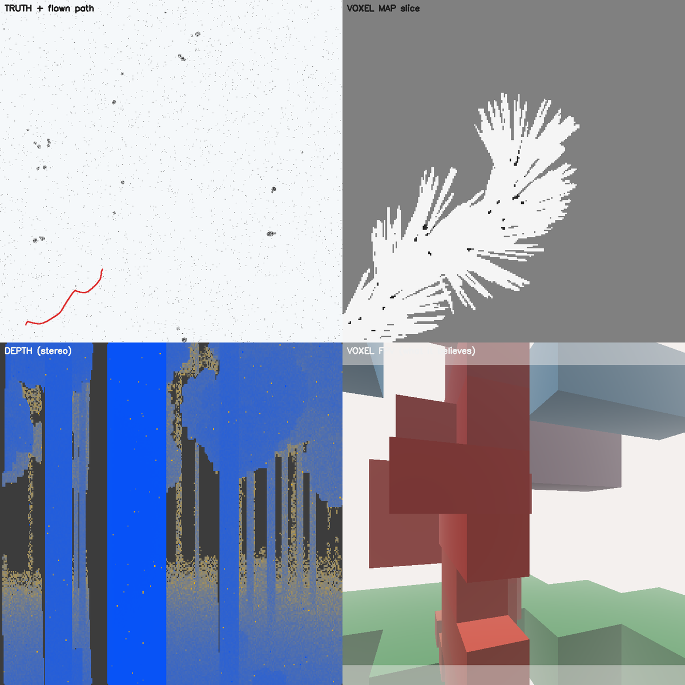
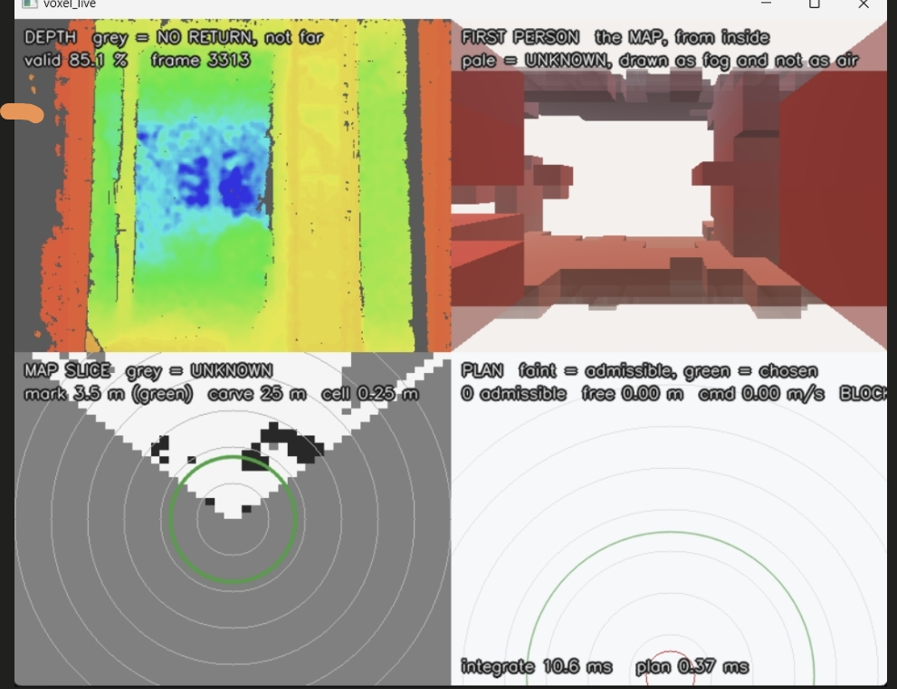

# GNSS-Denied Autonomy on a €500 Quadcopter

*A companion-computer perception and planning stack for an ordinary analog FPV
multirotor. Raspberry Pi 5, 8 GB, CPU only. No GPU, no ROS, no satellite fix.*

**Formatted version:** [`docs/autonomy-technical-brief.pdf`](docs/autonomy-technical-brief.pdf) — 12 pages, A4.

Claims are tagged *(measured)* — a number behind it, from a run in this repo;
*(code)* — read from source, records what was written not what worked; and
*(asserted)* — believed, not tested.

---

## 1. Summary

A €500 analog FPV quadcopter already flies well. It has an attitude controller
that works, a pilot who can fly it, and a video link. What it cannot do is
*decide where to go* when the radio link is jammed and the satellite fix is gone.

This project adds that decision to an unmodified airframe: a Raspberry Pi 5, a
depth camera, and a serial line to the flight controller. The engineering
interest is not the hardware — every part is off the shelf. It is that the whole
design is derived from one measured sensor limit, and every subsequent choice
traces back to it.

## 2. Constraints, fixed before anything was designed

| Constraint | Consequence it forces |
|---|---|
| **No satellite fix.** Contested airspace takes GNSS first. | No global position anywhere in the flight path. Everything the planner uses is body-frame and short-lived. |
| **CPU only.** A Pi 5, no GPU, no accelerator. | Perception must fit in single-digit ms per frame. Learned models are admissible only where a wrong answer is cheap. |
| **The airframe is not modified.** | The autopilot keeps the attitude loop. The Pi may only ask for a direction and a speed. |
| **Attritable cost.** | No LiDAR, no custom PCB, no sensor beyond a stock D435i. |
| **Analog video is the pilot's link and stays untouched.** | The Pi taps the existing composite signal passively — zero added latency to what the pilot sees. |

## 3. The measurement that determines the architecture

A stereo camera does not have a range. It has a range *per question*. For
*"may I put a voxel of edge `c` here?"* the answer holds only while the range
error along the ray stays smaller than the cell:

```
Z_max = √(c · f · B / σ_d) × 0.75      →  3.54 m at 0.25 m cells on the D435i
```
*(measured)*

Past that the depth image still carries information — just not at voxel
resolution, because stereo error is **anisotropic and increasingly so**. Along
the ray it grows quadratically, across it only linearly. The ratio is `Z·σ/B`:
**10:1 at 2 m, 100:1 at 20 m**. A cube must be sized for the worse axis, so a
voxel honest in range at 20 m would be 8 m wide and would discard the 4.5 cm of
lateral detail the sensor still resolves.

> **Cubes near. Bearings far.** Every other decision is downstream of this one.

## 4. Architecture

```
   analog FPV camera ──► USB capture ──┐
                                       ├──► frame
   D435i (depth + IR + IMU) ───────────┘      │
                                              ▼
        ┌──────────────── PERCEPTION ─────────────────┐
        │  NEAR: VoxelMap          FAR: BearingField  │
        │  3-level ladder          360 az × 48 el     │
        │  3-state log-odds        1° bins            │
        │  MAY VETO                MAY ONLY ADVISE    │
        └────────┬──────────────────────┬─────────────┘
                 ▼                      ▼
     ┌─ TrajectoryPlanner ─┐  ┌── OBSTACLE_DISTANCE ──┐
     │ 210 primitives      │  │  72 bins → ArduPilot  │
     │ swept sphereClear   │  │  independent avoidance│
     └──────────┬──────────┘  └───────────────────────┘
                │  bearing + speed
                ▼
     ┌─ WorldState blackboard ─┐   latch + stamp + Fresh()
                ▼
     ┌─ FcLink, own thread ────┐   SET_ATTITUDE_TARGET
     │ stale command → NEUTRAL │
                ▼
          ArduPilot (attitude + rate control, unmodified)
```

### 4.1 The near field is a ladder, not a grid

One cell size cannot be honest at 2 m and 12 m, so the near field is three maps,
each integrated and consulted only inside its own honest band. Every level
derives its own `Z_max` from the formula rather than carrying a hardcoded number.
*(code)*

| Level | Cell | Ray stride | Marks to | Carves to | Role |
|---|---|---|---|---|---|
| fine | 0.25 m | 1× | 3.54 m | 11.17 m | the only level allowed to veto |
| mid | 1.00 m | ¼ rays | derived | 25 m | covers the gap an 8× jump leaves |
| far | 2.00 m | 1/16 rays | derived | 40 m | extends steering horizon only |

Two load-bearing details:

- **Marking and carving are separate decisions with separate limits.** Erasing
  space you have seen *through* is safe much further out than asserting
  something is there.
- **Handovers sit at the exact marking range, with no overlap.** A 2 m cell's
  near face can sit 2 m in front of the surface it contains, so consulting a
  coarse level inside a fine level's band draws obstacles far too close.
  Consulting by nearest-hit instead of by band collapses the ladder to its
  coarsest rung — three levels integrated, one ever drawn. Both were observed on
  real hardware before the rule was written down. *(measured)*

### 4.2 Three states, because unknown is not free

`FREE`, `OCCUPIED`, `UNKNOWN`. A two-state grid cannot represent "I have not
looked there", so it answers *"is this tube clear?"* with *yes* for space it has
never observed.

This produced a real failure. Scoring an unobserved direction as maximally open
makes **straight up** the most attractive heading in the world, because the sky
returns nothing. The aircraft climbed.

```cpp
const float r = far->field->rangeAt(endAz, endEl);
farOpen = (r < 0.f) ? 0.f                       // unknown scores ZERO, not full reach
                    : std::min(r, far->rangeM) / std::max(0.1f, far->rangeM);
```

The climb penalty is charged against the *commanded* elevation and descent is
penalised identically. A one-sided penalty does not remove the bias, it inverts
it: maximum descent went 0.10 → 0.80 m before symmetry was restored. *(measured)*

### 4.3 Authority asymmetry

| | Near field | Far field |
|---|---|---|
| May do | hard-reject a primitive whose swept 0.6 m ball touches OCCUPIED | contribute one weighted score term |
| Cost of an error | a manoeuvre is deleted; enough of them and the aircraft stops | a slightly worse heading |
| Admits a learned model | no | yes |

> **Inventing awareness is cheap. Inventing permission is not.**

### 4.4 The planner

| Parameter | Value | Why |
|---|---|---|
| Primitives | 210 | 13 yaw × 5 climb × 3 speed = 195 forward, plus 15 escape (5 of 8 rearward directions clearing a 60° off-nose gate × 3 climb) |
| Horizon | 2.0 s @ 0.1 s | time not distance, so a slow primitive is not judged over a longer path |
| Robot radius | 0.60 m | configuration-space inflation |
| Yaw lag τ | 0.35 s | a heading the airframe cannot reach is not a plan |
| Stopping | 3.0 m/s², 0.25 s react | speed capped so it can stop inside what it has mapped |

Score weights: goal 1.00, clearance 0.70, far-field openness 0.50, smoothness
0.25, climb/descent 2.00 each. `sphereClear` is a hard gate applied *before*
scoring — score terms trade against each other, the veto does not trade.

## 5. The flight-controller link

| | Who estimates position | Pi sends | Verdict |
|---|---|---|---|
| A | the Pi; autopilot consumes it | synthetic GPS / vision pose | retired |
| B | the autopilot; Pi sends measurements | odometry increments + covariance | correct for v2 |
| **C** | **nobody** | body-frame attitude commands | **correct for v1** |

**Why A is not merely suboptimal but statistically wrong.** EKF3 treats every
input as an independent measurement with a stated covariance. Feed it an
estimate already filtered on the Pi and you have two filters in series, neither
aware of the other, and a covariance that no longer means anything. The failure
is silent: the estimate looks plausible and is overconfident.

**Downlink.** `ATTITUDE` (30), `HEARTBEAT` (0), `RC_CHANNELS` (65),
`SYS_STATUS` (1), `EKF_STATUS_REPORT` (193, decoded but **not yet consumed**),
`GPS_RAW_INT` (24, logged and routed nowhere else).

**Uplink — attitude, not velocity.** The consequence most likely to bite on a
field day, stated in the design rather than discovered on the flight line:
GUIDED velocity setpoints require a horizontal velocity estimate, and without
satellites there is not one. So speed is expressed as a pitch angle. Yaw is
commanded absolutely, so the path **refuses to send without a fresh attitude**
rather than guessing a heading.

**Defence in depth, at no cost.** `OBSTACLE_DISTANCE` (330) — 72 distances by
bearing, bin 0 at the nose, 65535 sentinel, golden-frame pinned. Publishing it
enables a second avoidance layer *inside ArduPilot*: different code, different
failure modes, no dependence on our planner.

## 6. Concurrency and the freshness doctrine

Perception results are **latched**, so a stalled thread leaves its last result
readable — right for control, and a trap, because a latch from a dead thread is
indistinguishable from a live one. So freshness is explicit everywhere:
monotonic stamps at production time, `corridorFresh(maxAge)` rather than a bare
flag, **neutral hover** substituted when the planner goes stale, and
latest-value frame handoff rather than queueing.

The same rule appears three times in three subsystems — `unknown ≠ free` in the
map, `Fresh()` in the blackboard, neutral hover on the link. All three say:
*absence of evidence is not evidence, and the system must be able to say so.*

## 7. Decision register

| Decision | Chosen | Rejected, and why |
|---|---|---|
| Flight stack | ArduPilot | mature EKF3, documented GNSS-denied config, consumes our proximity output directly |
| Who estimates position (v1) | **nobody** | Pi-side estimation double-filters against EKF3 |
| Uplink | `SET_ATTITUDE_TARGET` | velocity setpoints need a velocity estimate that does not exist |
| Near representation | 3-state voxels | 2-state cannot express "unobserved" |
| Far representation | bearing bins | anisotropy makes far cubes wasteful and dishonest |
| Far-field authority | advisory only | an invented obstacle must not delete a manoeuvre |
| Memory | latch + stamp + freshness | a latch from a dead thread looks live without a clock |
| Stale command | neutral hover | repeating a stale motion command is the worst option |
| GNSS | received, logged, routed nowhere | makes the exclusion claim checkable by inspection |
| Coarse rung beyond 12 m | retired | bearings are 33× finer for less compute |
| 0.10 m near rung | retired | −37 % frame budget *and* worse coverage (76.3 % vs 100 % at 2 m) |
| Learned far-field depth | parked | monocular depth measured close-field-only |

## 8. Evidence: two planners

Six worlds × eight seeds, paired. The histogram planner wins progress in **all
six worlds, significantly** (|t| 2.76–17.71). Taken alone that reads as a
verdict; it is not.

**The trajectory planner is not blocked, it is throttled.** 195–207 of 210
primitives reject on *genuinely mapped* occupied cells, free distance correctly
near zero, speed correctly zero. Indoors the 2 s rollout is longer than the room.
The histogram planner never stops because it never asks for a tube — it steers.
It is checking less, and that is the entirety of its advantage.

| World | clearance Δ (traj − hist) | \|t\| | traj wins |
|---|---|---|---|
| forest | +0.035 m | 0.34 | 1/8 |
| lanes | +0.110 m | 1.28 | 5/8 |
| city | −0.016 m | 0.08 | 3/8 |
| road | −0.101 m | 1.49 | 2/8 |
| **indoor** | **+0.120 m** | **3.41** | **7/8** |
| **cul-de-sac** | **+0.605 m** | **3.69** | **6/8** |

Collisions 1 in 96 runs. The trajectory planner is **2–3× cheaper** (2.2 vs
7.1 ms, forest). Neither was retired; the measurement changed what each is *for*.

**A result that reversed under sample size.** At n=3 the far-field term appeared
to hurt. At n=48 the sign is opposite: turning it off improves progress
everywhere but produced two city collisions where on produced none.
*Called a bug on three samples; a safety feature on forty-eight.*

## 9. Evidence: motion estimation needs two sensors

The D435i carries an IMU. It does **not** compute optical flow — its depth ASIC
does stereo matching and nothing else. It does provide two rectified IR streams
and per-pixel depth from the same instant, which removes both hard parts of
computing flow yourself.

Inertial alone fails, and no better IMU repairs it, because drift is dominated
by attitude error: `drift ≈ ½·g·sin(θ_err)·t²`. Measured, the legs the planner
flies are 3.70 s against a 1.71 s budget at 1° of attitude error. Inertial error
grows as t², velocity-measured error as t — a difference in *order*, so only a
velocity measurement closes it.

Flow × depth supplies it: sparse IR grid match, forward-backward gated,
de-rotated with the autopilot attitude, scaled by per-point depth, 3×3 least
squares. Fused: **4.1× mean, 6.9× worst-case improvement**. *(measured)*

Flow **quality** barely mattered (5 % vs 15 % noise → 22 % change). Flow
**presence** dominated. So texture yield is the variable worth measuring and
accuracy the one worth ignoring.

> A textureless wall yields **no estimate**, rather than a confident zero. A
> confident zero is the lethal failure: the estimator believes it is stationary
> and integrates its own drift as truth.

## 10. What the aircraft sees



*Top left,* ground truth with the flown path — visible to the scorer and never to
the planner. *Top right,* a horizontal map slice: white observed free, grey
unknown, dark occupied. *Bottom left,* the stereo depth frame. *Bottom right,*
the aircraft's own first-person render of its map — the only pane the planner
can see.

**Colour in the first-person pane is height relative to the aircraft**, not
object class: green ~3.5 m below, red at its own altitude, blue above, with
per-face shading so a cube grid reads as geometry rather than noise. Distance
hazes surfaces toward the background; **uncertainty fog** washes out any surface
seen *through* unknown space in proportion to how much was traversed. A wall
behind four metres of unobserved volume is a guess, and it is drawn as one.

The split between top-left and bottom-right is the point of the harness. The
aircraft plans against its own noisy map; collisions are scored against ground
truth. They are different data structures on purpose — a harness that checked
the plan against the map it planned with would pass no matter how wrong the map
was.



The same pipeline on real sensor data, handheld indoors. Depth 85.1 % valid;
integrate 10.6 ms, plan 0.37 ms. Pale is unknown, drawn as fog and not as air.
The plan pane reads **0 admissible, 0.00 m/s, BLOCKED** — given a map it has not
earned, the correct output is to stop, and it stops.

## 11. Verification, status, and what is not done

**How it is verified.** Ground truth is a separate data structure from the map,
so collisions are never detected against the aircraft's own belief. A
perfect-depth control run accompanies every sensor run. Wire formats are pinned
against golden frames from an independent implementation (pymavlink), not
against our own encoder. 12 registered checks in `nav-sim/` all pass; 13 test
programs in `onboard/test/`. Any claim comparing two configurations uses
multi-seed paired statistics — single-seed results are anecdotes, because one of
them already reversed.

**Not done:**

1. **Nothing has run on a Pi 5.** Every timing here is dev-box; a Cortex-A76 on
   memory-bound work is plausibly 1.5–2.5× slower *(asserted)*. An afternoon's
   work, and it reprices every plan in the project.
2. **The depth camera has never flown.** All real captures are handheld.
3. **Flow yield on real bark and foliage is unmeasured.** Correctness is settled;
   yield is not, and §9 shows yield decides the outcome.
4. **The IR stream is defined but never requested**, so the flow estimator has no
   frames to consume.
5. **Two world models share no code** — 0.5 m/2-state/1.5 m radius against
   0.25 m/3-state/0.35 m. Three angular resolutions and two radii differing by 4×
   is an accident of two codebases, and the 2-state one cannot express the rule
   the safety argument rests on.
6. **The `OBSTACLE_DISTANCE` publisher** exists only in the sim tree.
7. **Autopilot estimator health is decoded but not consumed.**
8. **Retired architecture-A fields remain** in the world state; mark unwired
   rather than delete — they are correct code for architecture B.
9. **The non-satellite autopilot configuration is not written down.** GUIDED will
   refuse to engage until it is, and the symptom presents as a broken link.

Items 1–4 are what stands between this and a first flight, and none is large.
5 and 8 are architecture debt. Item 3 is the only one that could invalidate a
design decision rather than merely delay it.

---

*Scope: a working technical demonstrator built to explore what is achievable on
cheap, CPU-only hardware. Not a certified or commercially flown system.
Validation status is stated explicitly throughout rather than summarised
favourably.*
