# Drag and efficiency tools

Three tools for this repository's aircraft:

- **The efficiency study** (`efficiency.py`) is the one with real
  aerodynamics. It optimizes the Kipinä wing's airfoil with NeuralFoil, an
  XFOIL-trained model, within what the printed wing and the plane need. It
  then compares the whole plane before and after, with charts
  ([study/index.html](study/index.html)).
- **The cross-checks** (`crosscheck.py`) run the study's two wing sections and
  the whole plane through independent tools: XFOIL, 2D CFD in OpenFOAM, and
  AeroSandbox's drag build-up and vortex lattice
  ([Cross-checks](#cross-checks-do-other-tools-agree)).
- **The handbook optimizer** (`optimize.py`) searches design choices with a
  drag build-up of handbook formulas. It covers the Kipinä airframe
  (`airframe`), and a typical 5-inch (`quad`) and 7-inch (`quad7`) FPV quad.
  The quads keep their stock motors, props and battery (see
  [What the quad models will not do](#what-the-quad-models-will-not-do)).

## Efficiency study: the Kipinä wing and the whole plane

```sh
pip install -r aero/requirements.txt
python3 aero/efficiency.py              # about a minute; writes aero/study/
python3 aero/efficiency.py --n-crit 5   # a rougher printed skin, or gusty air
node aero/tools/shoot.mjs               # the chart PNGs below (needs playwright)
```

It writes these files:

- `study/study.json`: the data behind the charts;
- `study/REPORT.md`: the numbers as tables;
- `study/kipina-opt.dat`: the optimized airfoil's coordinates, in Selig
  format for XFLR5 or the CAD;
- `study/index.html`: the comparison page. Serve the `study/` folder over HTTP
  to open it.

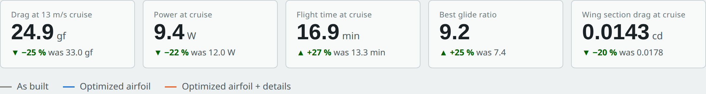

**How it works:**

1. **Operating points.** It takes the plane as built from
   `airframe/design.py`: chord 97 mm, 223 g, NACA 4412. It flies three points
   at the lift coefficient and Reynolds number each one needs: loiter at
   10.7 m/s, cruise at 13 m/s and fast at 18 m/s. The objective weights them
   3 : 5 : 2.
2. **Section optimization.** The airfoil is a Kulfan (CST) shape with 17
   free weights. SLSQP minimizes the weighted profile drag from NeuralFoil
   while holding these limits:
   - room for the 3 mm and 2 mm spars;
   - the SG90 aileron servo standing out below the wing no more than now;
   - enough depth at the aileron hinge;
   - the 0.8 mm printable trailing edge;
   - at least the NACA 4412's maximum lift, so the stall speed holds;
   - a stall no sharper than the NACA 4412's;
   - a pitching moment no more nose-down;
   - only shapes NeuralFoil is confident about.

   It starts from four known airfoils (NACA 4412, SD7062, SD7037, E387) and
   lands on the same shape from all four.
3. **Whole plane.** It puts the new section into the whole plane: the wing's
   profile drag from NeuralFoil at every speed, the induced drag, and every
   other part from the drag build-up. There are three versions: as built,
   with the optimized airfoil, and with the airfoil plus the detail changes
   the handbook optimizer picks.

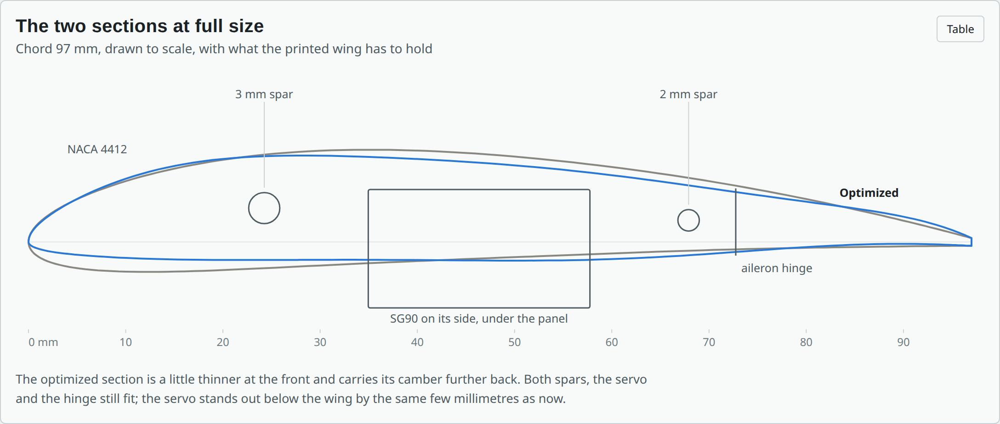

**Wing section.** Profile drag falls 18 % at loiter, 20 % at cruise and
25 % at 18 m/s.
- **Limits:** every one still holds.
- **Maximum lift:** 1.41, against 1.38 for the NACA 4412.
- **Pitching moment:** milder (−0.085 against −0.104), so the tail needs less
  trim.
- **Stall:** it peaks at 10.5° instead of 14°, then settles at about the
  NACA 4412's level, a slightly sharper stall.
- **Rough skins:** it is also less sensitive to an early transition from the
  printed skin. Its cruise drag coefficient moves 0.0142–0.0151 between n_crit
  5 and 9, against 0.0158–0.0214 for the NACA 4412.
- **Known thin airfoils:** SD7037 and E387 have less drag than the NACA 4412,
  but they are too thin for the servo and lose lift near the stall.

| Drag at the operating points | Drag polar at cruise |
|---|---|
| 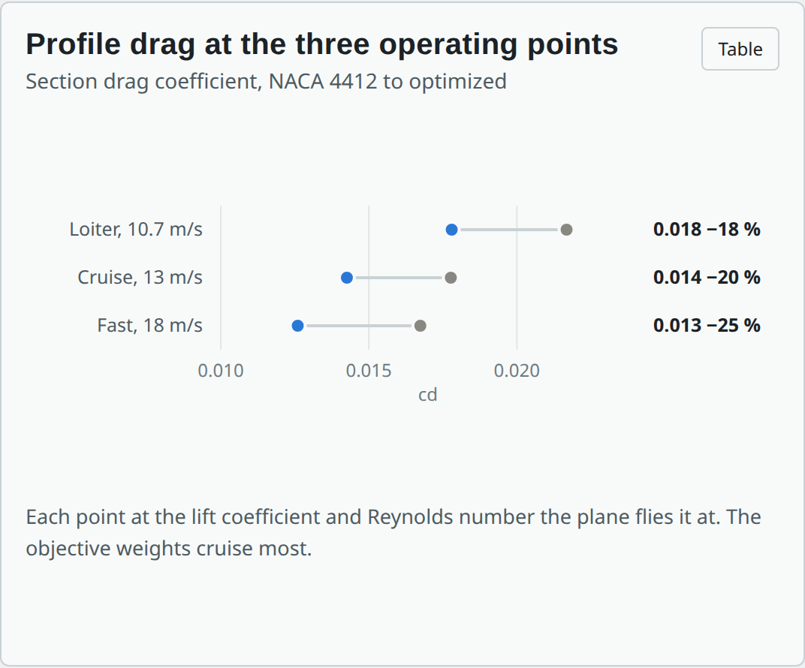 | 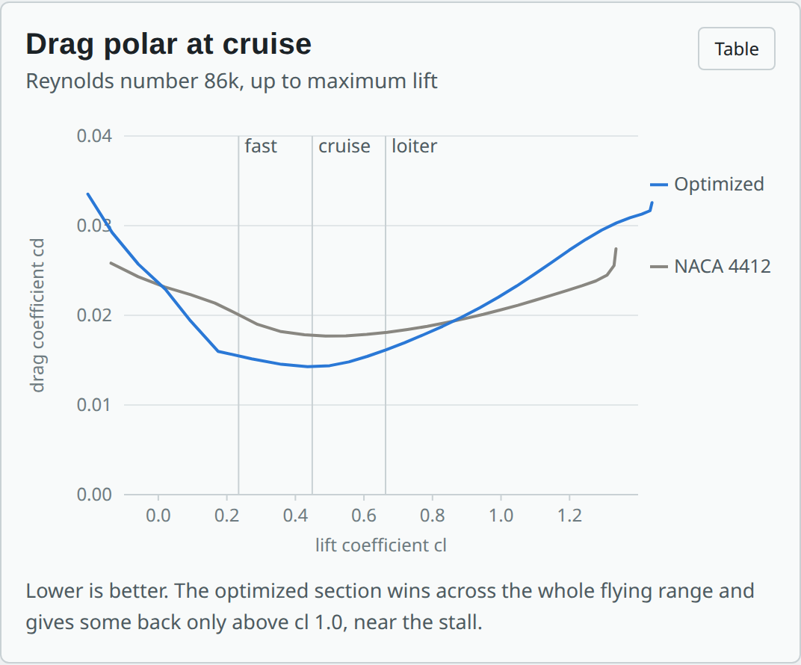 |
| **Lift near the stall** | **Surface pressure at cruise** |
| 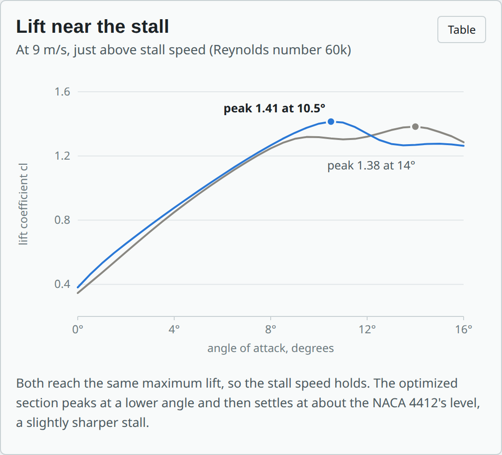 | 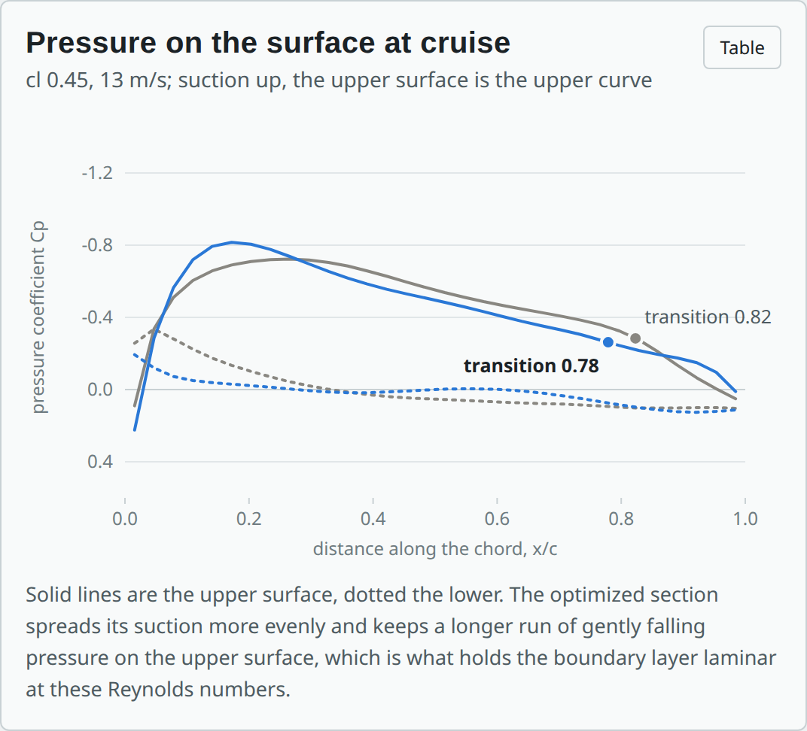 |

**Whole plane.** At the 13 m/s cruise:

| | As built | Optimized airfoil | Airfoil + details |
|---|---|---|---|
| Drag | 33.0 gf | 31.2 gf | 24.9 gf |
| Power | 12.0 W | 11.4 W | 9.4 W |
| Flight time | 13.3 min | 14.0 min | 16.9 min |
| Best glide ratio | 7.4 | 7.7 | 9.2 |

- **Stall speed:** stays at 8.9 m/s.
- **Induced drag:** the largest single item. It depends on weight and span,
  which the brief fixes, so the optimization leaves it alone.

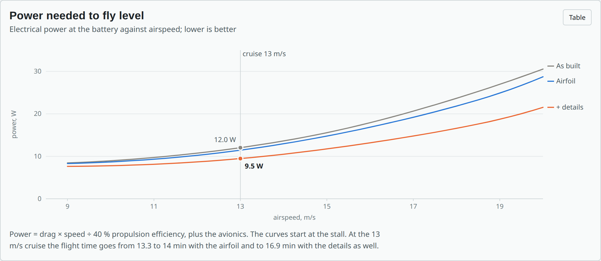

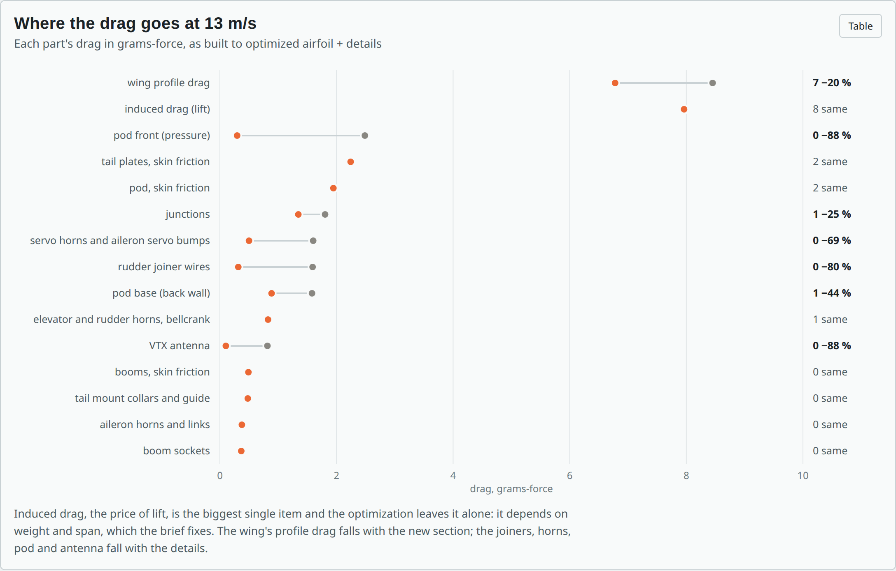

**Limits of the study:**
- **NeuralFoil:** its results match XFOIL (checked below). At these Reynolds
  numbers XFOIL is good for ranking sections, but optimistic about laminar
  flow on a printed skin.
- **Whole-plane numbers:** they carry the drag build-up's ±30 %.
- **Detail changes:** they are not in the CAD yet.
- **Check before trusting the minutes:** print one wing panel of each section
  and compare glides.

## Cross-checks: do other tools agree?

```sh
sudo apt install xfoil openfoam            # Ubuntu; OpenFOAM only for --cfd
python3 aero/crosscheck.py                 # NeuralFoil, XFOIL, AeroSandbox: under a minute
python3 aero/crosscheck.py --cfd --work runs/cfd            # and 2D CFD: about 3 hours on 4 cores
python3 aero/crosscheck.py --cfd --work runs/cfd --resume   # carry on after a stop
```

It runs the same two wing sections and the same plane through independent
tools. It writes `study/crosscheck.json` and `study/CROSSCHECK.md` (the numbers
as tables), and the study page gets a cross-check section.

| Tool | What it checks | How |
|---|---|---|
| NeuralFoil, xxxlarge | the network's own fit | its biggest network, on the same points |
| XFOIL 6.99 | NeuralFoil against the code it imitates | the exact shapes at the design lift, a stall sweep, n_crit 5 to 9 (`xfoil.py`) |
| OpenFOAM v1912 | different physics | 2D RANS, k-ω SST with Langtry–Menter transition, a 67k-cell C-grid with y+ under 1, a point-vortex far field (`cfd.py`) |
| AeroSandbox AeroBuildup | the whole-plane drag build-up | its own component drag models |
| Vortex lattice (AeroSandbox) | the induced drag | span efficiency in the Trefftz plane |

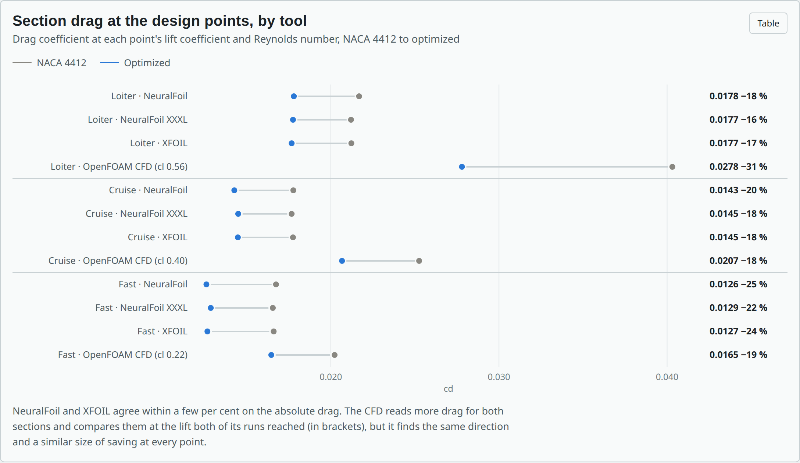

**Wing section.** Drag change from the NACA 4412 to the optimized section:

| | Loiter | Cruise | Fast | Weighted |
|---|---|---|---|---|
| NeuralFoil (the study) | −18 % | −20 % | −25 % | −20 % |
| NeuralFoil, xxxlarge | −16 % | −18 % | −22 % | −18 % |
| XFOIL | −17 % | −18 % | −24 % | −19 % |
| OpenFOAM CFD, at equal lift | −31 % | −18 % | −19 % | −24 % |

- **XFOIL** matches NeuralFoil within 2–3 %:
  - cruise drag 0.0177 and 0.0145, against 0.0178 and 0.0143;
  - maximum lift 1.40 and 1.42, against 1.38 and 1.41;
  - the angles those peaks come at.

  The optimizer did not exploit a gap in the network.
- **Surface quality:** XFOIL also finds that the new section's cruise drag
  barely moves between n_crit 5 and 9 (0.0145–0.0152). The NACA 4412's runs
  0.0156–0.0216.
- **CFD set-up check:** at a Reynolds number of 1 million, where XFOIL and RANS
  are both dependable, the CFD gives the NACA 4412:
  - lift 0.905 (XFOIL 0.925);
  - drag 0.0072 (XFOIL 0.0074);
  - transition in the same place.

  The mesh, the far field and the force integration are sound.
- **CFD at the plane's Reynolds numbers:**
  - **The NACA 4412:** the upper surface stays separated from about mid-chord
    to the trailing edge, where XFOIL closes a short bubble. So the CFD reads
    20–90 % more drag than XFOIL for both sections, and a solution that keeps
    swinging.
  - **The optimized section:** the flow is back on the surface before the
    trailing edge at loiter and cruise.
  - **At the same lift:** the optimized section has 18–31 % less drag.
  - **Grid sensitivity:** a coarser grid reads 25 % more drag on the NACA 4412
    at cruise, so the CFD's absolute numbers are uncertain by tens of per
    cent.

  Its ranking agrees with the other tools.

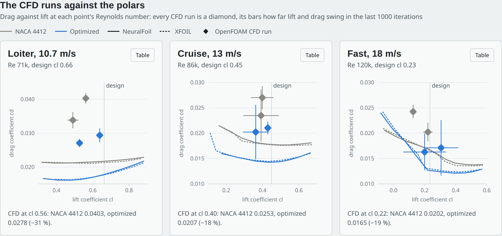

**Whole plane.** At 13 m/s, as built:

| Part | Study's build-up | AeroBuildup |
|---|---|---|
| Wing profile | 8.5 gf | 8.8 gf |
| Tail | 2.2 gf | 1.8 gf |
| Pod | 6.0 gf | 3.5 gf |
| Booms, sockets, tail mount | 1.3 gf | 0.7 gf |
| Horns, wires, antenna | 5.2 gf | not modelled |
| Junctions | 1.8 gf | not modelled |
| Induced | 8.0 gf | 7.9 gf |
| **Total** | **33.0 gf** | **22.7 gf** |

- **AeroBuildup:**
  - **The wing**, the one part both model the same way, agrees within 4 %.
  - **The rest of the gap** is in parts it has no model for: the blunt pod
    nose, the horns, wires and antenna, and the junctions. So its total is a
    floor, not a better estimate.
  - **The optimized airfoil:** both give it the same saving (1.7 against
    1.8 gf).
- **Vortex lattice:** the span efficiency is 0.93, against the study's 0.8, so
  the study's induced drag is about 14 % high. Cruise drag would be 31.9 gf
  instead of 33.0.

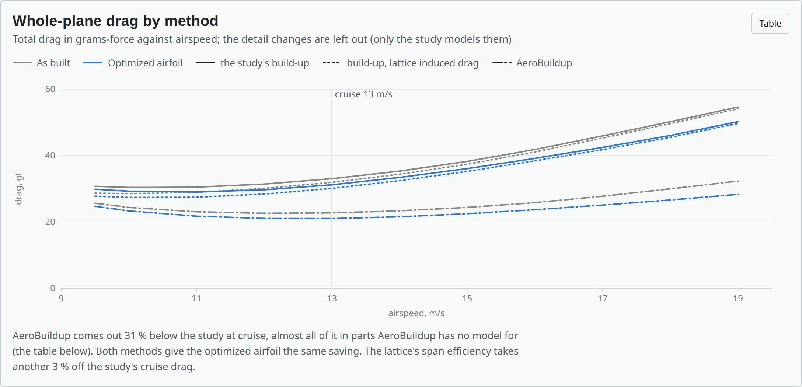

**What this means:**
- **The airfoil saving:** it holds up in every tool.
- **The whole-plane numbers:** they look, if anything, pessimistic.
- **A glide test:** still the real check.

**Two notes on running the cross-checks:**
- **Ubuntu's XFOIL** crashes on a floating-point trap. `xfoil.py` builds a
  one-line shim that turns the trap off.
- **Ubuntu's OpenFOAM** crashes on any in-run function object. `cfd.py` works
  out the forces, pressure and friction from the written fields instead.

## Handbook optimizer

```sh
python3 aero/optimize.py airframe                 # Kipinä drag at its 13 m/s cruise
python3 aero/optimize.py airframe --free span     # let the span grow too (the brief fixes it)
python3 aero/optimize.py airframe --only fairings,boattail
python3 aero/optimize.py quad                     # quad aerodynamics at 60 km/h
python3 aero/optimize.py quad --kmh 40            # ... at 40 km/h
python3 aero/optimize.py quad --fix motor_tilt    # keep the motors straight
python3 aero/optimize.py quad7                    # 7-inch long-range quad at 100 km/h
```

It needs nothing beyond Python. Its drag build-up uses handbook formulas, not
CFD or thrust-stand data. That makes it good for ranking design changes and
seeing what matters, but not for exact numbers. Each run prints a summary and
writes `aero/REPORT_<model>.md`, which has:

- the result before and after;
- the changes in the optimum;
- **one change at a time**: each parameter moved alone to its best value,
  ranked by how much it helps;
- the drag build-up, item by item;
- every parameter's range and what limits it.

### Results

#### Typical 5-inch FPV quad, at 60 km/h ([REPORT_quad.md](REPORT_quad.md))

The quad is an ordinary 6S freestyle build: 2306 1750 KV motors, 5.1 × 4.3
tri-blades, a 6S 1100 mAh LiPo and 504 g all-up. Its propulsion stays stock.
The optimizer changes only the airframe's aerodynamics and scores each version
by the power it needs for a steady 60 km/h cruise. That power includes:

- the body's drag;
- the prop wash pushing down on the arms;
- the weight of any printed part.

At 60 km/h the stock quad pitches 18° nose down, and at that angle the top of
the battery, the body plates and the flat faces of the arms all catch the
air. The drag area comes to about 96 cm²: the arms 29 %, the motor bells 22 %,
the body's tilted top face 14 %, the stack and the battery front 10 % each.

| | typical build | optimised |
|---|---|---|
| Drag area | 96 cm² | 51 cm² |
| Body drag at 60 km/h | 1.63 N | 0.87 N |
| Power at 60 km/h | 146 W | 128 W (−12 %) |
| Flight time at 60 km/h | 8.0 min | 9.1 min |
| All-up weight | 504 g | 517 g |

The optimum:

- **Motors tilted forward 10°** on printed wedges, so the body flies level at
  this speed instead of 18° nose down. This is the big one: −10 % of the power
  on its own. The camera's uptilt has to drop by the same 10°, and the quad
  hovers 10° nose up.
- **Streamlined printed sleeves on the arms** (+12 g): −3.7 % on their own.
  They cut the arms' drag and the prop wash on them.
- **Arms 13 mm wide instead of 14**, still within 80 % of the stock stiffness:
  −1.2 %.
- **A stubby VTX antenna** instead of an upright lollipop: −1.2 %. Laying the
  lollipop back 45° does nearly as well.

What else it found:

- **Fairings only pay without the motor tilt.** A full fairing over the stack
  and battery (+35 g) saves 3.7 % on a quad that flies nose-down, and with
  the motors held straight (`--fix motor_tilt`) the optimum takes it (−7.4 %
  in all). Once the body flies level, the fairing's weight costs more than
  its drag saves. A canopy over just the stack never earns its 10 g.
- **Battery on top or underneath makes no measurable difference.**
- **At 40 km/h the air hardly matters.** The quad pitches only 6°, the body
  drag is about 0.56 N, and the best the aerodynamics can do is −1.3 %.
  Aerodynamic work on a 5-inch quad pays at brisk cruising speeds, not at a
  gentle pace.

#### Typical 7-inch long-range quad, at 100 km/h ([REPORT_quad7.md](REPORT_quad7.md))

The same model on an ordinary 7-inch long-range build, 980 g:

- a 7-inch frame with 16 × 6 mm arms;
- 2806.5 1300 KV motors;
- 7 × 4 × 3 props;
- a 6S 3000 mAh LiPo;
- a GPS on a short mast.

100 km/h is fast for this class. To hold it, the stock quad pitches **47°
nose down**, and at that angle the arms' flat faces, the body's top and the
battery all face the air. The drag area comes to about 217 cm², more than
twice the 5-inch's at 60 km/h, and the drag, 10.3 N, is more than the quad
weighs.

| | typical build | optimised |
|---|---|---|
| Drag area | 217 cm² | 57 cm² |
| Body drag at 100 km/h | 10.3 N | 2.7 N |
| Cruise attitude | 47° nose down | about level (discs 14°, motors tilted 15°) |
| Power at 100 km/h | 648 W | 301 W (−54 %) |
| Flight time at 100 km/h | 4.9 min | 10.6 min |
| All-up weight | 980 g | 1060 g |
| Hover flight time | 15.9 min | 14.5 min |

The optimum takes everything on offer. Each change saves more power on its
own here than at 60 km/h:

| change | power at 100 km/h, on its own |
|---|---|
| Full fairing over the stack and battery (+60 g) | −23 % |
| Motors tilted forward 15° (the most allowed) | −17 % |
| Streamlined sleeves on the arms (+20 g) | −14 % |
| Arms 15 mm wide instead of 16 | −3 % |
| Stubby or laid-back VTX antenna | −1 % |

Together they save more than the single changes suggest. Stacked
independently, one after another, they would give about −47 %; the combined
optimum gets −54 %. They feed each other: less drag means less pitch, less
pitch hides the arms' and body's flat faces, and that means less drag
again.

- **Printed parts alone** (fairing, sleeves, antenna, no frame change and no
  motor tilt) get −37 %.
- **Motors kept straight** (`--fix motor_tilt`): −38 %.
- **Hover costs a little.** The printed parts add 80 g, and the hover flight
  time falls from 15.9 to 14.5 min. They pay only when the quad cruises fast.
- **At 60 km/h**, a more usual 7-inch cruise, the quad pitches 14°. The
  optimum is a canopy instead of the full fairing, sleeves and 7° of motor
  tilt: −10 % power, 14.8 → 16.5 min.

#### What the quad models will not do

The brief was to make a typical FPV drone better without it turning into an
interceptor:

- **Propulsion stays stock.** The motors, props and battery are untouched, so
  thrust-to-weight stays close to stock (7.8 for the 5-inch, 6.3 for the
  7-inch). It must stay inside the band its class flies with: 5 to 12 for the
  5-inch freestyle quad, 3 to 8 for the 7-inch long-range one.
- **Thrust headroom is kept.** A cruise may use at most 70 % of full thrust.
- **Only cruise power is scored.** There is no speed or acceleration objective,
  and the model does not estimate top speed. Less drag raises the top speed a
  little as a side effect, but nothing here rewards it.

An earlier version of the 5-inch model searched the props, motors and battery for
flight time instead. It is in the git history (commit `dbd5d35`).

#### Kipinä, at its 13 m/s cruise ([REPORT_airframe.md](REPORT_airframe.md))

The span is fixed by the brief: the smallest plane that passes the stall
limit. With that fixed, the rest of the sizing is pinned too:

- a higher aspect ratio would push the stall over the limit, and leave no room
  for the SG90 tabs;
- a longer tail arm would move the wing aft and make the lid too long for the
  bed.

The drag to win is in the details. Together they cut the drag by about a
fifth (32 → 26 gf, endurance 13.6 → 16.4 min at this speed):

| change (none of these is in the CAD yet) | drag saved on its own |
|---|---|
| Round or chamfer the pod's top front edge (the front of the lid). It is the only sharp edge left on the nose. 6–8 mm does it; a 10 mm 45° chamfer does nearly as well and prints without support | 7.5 % |
| Run the rudder joiner wires in a groove under the stabiliser: 171 mm of 0.8 mm wire across the flow | 4.0 % |
| Printed fairings over the four servo horns and the aileron servo bumps | 3.4 % |
| Taper the pod's rear 30 mm at 12° towards the motor mount (the ESC moves forward) | 2.3 % |
| Lay the VTX whip back 60° | 2.2 % |

- **Letting the span grow** (`--free span`): the optimizer stretches the wing
  to 580 mm at aspect ratio 7 for the same area, and the drag falls by 24 %
  instead of 19.5 %. That is a bigger plane, against the brief.
- **Compared with `design.py`**: the build-up here counts more drag than the
  quick estimate (22.9 cm² against 18.4 cm²), mostly small parts that the
  quick estimate lumps together.

### How it works

- **`dragkit.py`** has the drag formulas:
  - skin friction on a flat plate (laminar, turbulent, or mixed) times a form
    factor for wings and bodies (Raymer);
  - pressure drag of a blunt front against how round its edges are
    (Hoerner);
  - base drag behind a square-cut rear;
  - rods, wires and strips across the flow.
- **`models/airframe.py`** builds the airframe from `airframe/design.py`.
  Changing the aspect ratio, the tail arm or the span re-sizes the tail,
  re-balances the plane and re-estimates its weight, exactly as the sizing
  loop does. The total drag includes the induced drag of carrying the weight.
  Every point must:
  - keep the stall at or under 8.95 m/s with the CAD weight;
  - leave room for the SG90 tabs in the wing;
  - fit the lid and the rear pod half on the bed.
- **`models/quad.py`** takes a stock quad (a `Build`: the 5-inch here,
  the 7-inch in `models/quad7.py`) and varies its aerodynamics:
  - the body: an open frame, a canopy, or a full fairing;
  - the battery on top or underneath;
  - the arm size, and sleeves over the arms;
  - forward-tilted motors;
  - the antenna.

  For each version it works out:
  - the body drag, with the pitch the drag itself sets;
  - the prop wash on the arms;
  - the added weight;
  - the stock props' rotor power in forward flight (momentum theory with
    Glauert's inflow and profile power);
  - the motor, ESC and battery losses.
- **`optimize.py`** first moves each parameter alone over its whole range.
  Then it searches all free parameters together: one grid step up and down on
  each, then pairs of parameters moved at once, so it can slide along a limit
  (for example, a longer tail arm with a different aspect ratio at the same
  stall speed). It keeps any move that helps by more than the model's
  resolution (0.03 % for the airframe, 0.2 % for the quad) without breaking a
  limit, and halves the step when nothing does.

In the reports, the **kind** column says whether a change is a parameter of
the CAD, a what-if the CAD doesn't build yet, or a part you choose.

### Adding a model

A model is a module in `aero/models/` with:

- `NAME`, `TITLE`, `OBJECTIVE` (what is optimised), `MAXIMIZE`, `BASE_LABEL`
  (what the starting design is called), `NOTE`, `METHOD` and `SPEED` (m/s);
- if it has a drag build-up, `AREA_UNIT` (a label and a scale from m²) and
  `ITEMS_NOTE`;
- optionally `DEFAULT_FIX`: parameters held unless `--free` names them;
- optionally `MIN_GAIN`: the smallest improvement worth a move (default 0.03 %);
- `params()`, which returns a list of `model.Param`: the starting value, the
  range, the step, the unit, what limits it, and its kind;
- `evaluate(x, v)`, which returns a `model.Result`: the objective, the drag
  items, the numbers to show and any limits broken;
- `speed_text(v)` and `value_text(value)` for the report.

### Limits

- The coefficients come from handbooks and typical-prop fits, not
  measurements. Expect about ±30 % on the drag of each part (the airframe's
  Reynolds numbers are low: 50 000 to 300 000). The ranking and the differences
  between versions are more reliable than the totals.
- The optimizer finds a local optimum on each parameter's grid. The paired
  moves, and a restart from the best single change, cover the cases here.
- It only knows the limits written into each model. A change can look good
  here and still be a bad idea for structure, cost or use, so read the
  "limit" column before acting on one.
