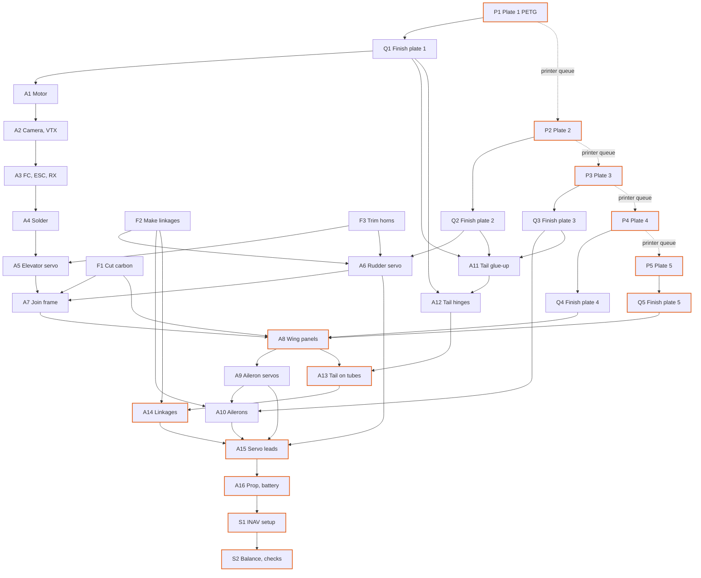

# Kipinä: bill of process

Generated by `process.py` from the CAD model and the slicer. Do not edit by hand.

One builder and one Bambu Lab A1 mini. Print times come from PrusaSlicer 2.7, A1-mini-like profile (tools/a1mini.ini); hand times are Boothroyd-Dewhurst handling and insertion estimates plus shop times for gluing, soldering and bending (see `process.py`).

| | |
|---|---|
| Printer time | 7 h 24 min over 5 plates, 71 g of filament |
| Hands-on time | 1 h 38 min (prep, assembly, setup) |
| Epoxy cure waits | 45 min |
| Lead time | **8 h 54 min** with the builder working while the printer runs |
| Critical path | P1 > P2 > P3 > P4 > P5 > Q5 > A8 > A13 > A14 > A15 > A16 > S1 > S2 |

## Precedence graph

Solid arrows: must finish first. Dashed: the printer queue. Highlighted: critical path.

## Operations

| op | operation | station | resource | time | start | end | needs | tools / consumables |
|---|---|---|---|---|---|---|---|---|
| P1 | Print plate 1: pod, lid, tail mount, rudders, bellcrank | Print | printer | 1 h 23 min | 0 min | 1 h 23 min | - |  |
| F1 | Cut the carbon tubes and spars | Prep | builder | 3 min | 0 min | 3 min | - | rotary tool or fine saw, ruler, file |
| F2 | Make the pushrods, aileron links and rudder joiners | Prep | builder | 11 min | 3 min | 14 min | - | wire bender or pliers, cutter, heat gun, CA, heat-shrink |
| F3 | Trim the elevator (13.5 mm) and rudder (11 mm) servo horns | Prep | builder | 1 min | 14 min | 15 min | - | side cutter |
| P2 | Print plate 2: wing centre, fins | Print | printer | 1 h 53 min | 1 h 23 min | 3 h 20 min | - |  |
| Q1 | Finish plate 1 parts, ream tube and pivot holes | Prep | builder | 3 min | 1 h 23 min | 1 h 26 min | P1 | 6.2 / 1.6 mm drill bits in a pin vice |
| A1 | Screw the motor to the pod | Pod | builder | 1 min | 1 h 26 min | 1 h 27 min | Q1 | 1.5 mm hex driver |
| A2 | Fit the camera and VTX | Pod | builder | 1 min | 1 h 27 min | 1 h 28 min | A1 | CA, foam tape |
| A3 | Mount the FC, ESC and receiver | Pod | builder | 1 min | 1 h 28 min | 1 h 29 min | A2 | 1.5 mm hex driver, foam tape |
| A4 | Solder the power, motor, video and receiver wiring | Pod | builder | 9 min | 1 h 29 min | 1 h 37 min | A3 | soldering iron, solder, heat-shrink, silicone wire |
| A5 | Glue the elevator servo into the rear bay | Pod | builder | 1 min | 1 h 37 min | 1 h 38 min | A4, F3 | hot glue |
| P3 | Print plate 3: stabiliser, elevator, ailerons | Print | printer | 1 h 12 min | 3 h 20 min | 4 h 33 min | - |  |
| Q2 | Finish the wing centre and fins, ream holes | Prep | builder | 2 min | 3 h 20 min | 3 h 22 min | P2 | 6.2 / 3.2 / 2.2 mm drill bits |
| A6 | Fit the rudder servo and its pushrod in the wing centre | Wing | builder | 1 min | 3 h 22 min | 3 h 24 min | Q2, F2, F3 | hot glue |
| A7 | Join the tubes, pod and wing centre | Frame | builder | 3 min + 15 min cure | 3 h 24 min | 3 h 27 min | A5, A6, F1 | 5-minute epoxy |
| P4 | Print plate 4: right wing panel | Print | printer | 1 h 28 min | 4 h 33 min | 6 h 01 min | - |  |
| Q3 | Finish the tail surfaces and ailerons | Prep | builder | 1 min | 4 h 33 min | 4 h 34 min | P3 |  |
| A11 | Glue the stabiliser to the tail mount and the fins to the tips | Tail | builder | 1 min | 4 h 34 min | 4 h 36 min | Q1, Q2, Q3 | CA |
| A12 | Hinge the elevator and rudders, screw on the bellcrank | Tail | builder | 3 min | 4 h 36 min | 4 h 38 min | A11, Q1 | 1.5 mm hex driver, hinge tape |
| P5 | Print plate 5: left wing panel | Print | printer | 1 h 28 min | 6 h 01 min | 7 h 29 min | - |  |
| Q4 | Remove the brim from the right panel, ream spar holes | Prep | builder | 2 min | 6 h 01 min | 6 h 03 min | P4 |  |
| Q5 | Remove the brim from the left panel, ream spar holes | Prep | builder | 2 min | 7 h 29 min | 7 h 31 min | P5 |  |
| A8 | Slide in the spars and glue on both wing panels | Wing | builder | 2 min + 15 min cure | 7 h 31 min | 7 h 33 min | A7, Q4, Q5, F1 | 5-minute epoxy |
| A9 | Fit the aileron servos and route their leads | Wing | builder | 2 min | 7 h 48 min | 7 h 50 min | A8 | hot glue |
| A10 | Hinge the ailerons, glue the horns, fit the links | Wing | builder | 3 min | 7 h 50 min | 7 h 53 min | A9, Q3, F2 | hinge tape, CA |
| A13 | Slide the tail onto the tubes, square it and glue | Frame | builder | 3 min + 15 min cure | 7 h 53 min | 7 h 56 min | A12, A8 | 5-minute epoxy |
| A14 | Connect the elevator pushrod, rudder pushrod and joiners | Final | builder | 1 min | 8 h 11 min | 8 h 12 min | A13, F2 |  |
| A15 | Plug in the servo leads and tidy the wiring | Final | builder | 1 min | 8 h 12 min | 8 h 13 min | A14, A10, A9, A6 |  |
| A16 | Fit the prop, battery, antenna and lid | Final | builder | 1 min | 8 h 13 min | 8 h 14 min | A15 | prop wrench |
| S1 | Bind the receiver and set up INAV | Setup | builder | 32 min | 8 h 14 min | 8 h 46 min | A16 | laptop with INAV Configurator |
| S2 | Balance and run the pre-flight checks | Setup | builder | 8 min | 8 h 46 min | 8 h 54 min | S1 | CG balancer or fingertips |

## Parts per operation

- **P1** pod, lid, tail_mount, rudder_R, rudder_L, bellcrank
- **P2** wing_centre, fin_R, fin_L
- **P3** stab, elevator, aileron_R, aileron_L
- **P4** wing_R
- **P5** wing_L
- **A1** pod, motor, M2 screw (motor)
- **A2** camera, vtx
- **A3** fc, M2 screw (FC), esc, receiver
- **A5** servo_elev, servo horn (elevator), horn screw
- **A6** servo_rud, servo horn (rudder), horn screw, pushrod_rud
- **A7** wing_centre, tube_L, tube_R
- **A8** spar_main, spar_rear, wing_R, wing_L
- **A9** servo_ail_R, servo_ail_L
- **A10** aileron_R, aileron_L, horn_ail_R, horn_ail_L, pushrod_ail_R, pushrod_ail_L
- **A11** tail_mount, stab, fin_R, fin_L
- **A12** elevator, rudder_R, rudder_L, bellcrank, M2 screw (bellcrank)
- **A13** tail sub-assembly
- **A14** pushrod_elev, joiner_R, joiner_L
- **A16** prop, battery, antenna, lid
