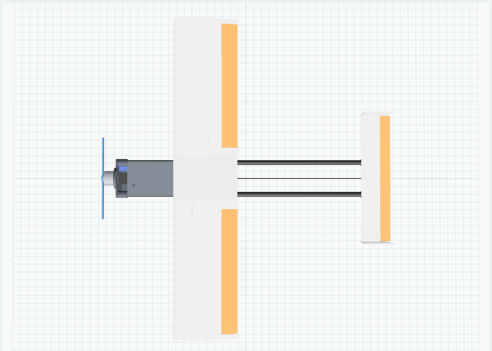
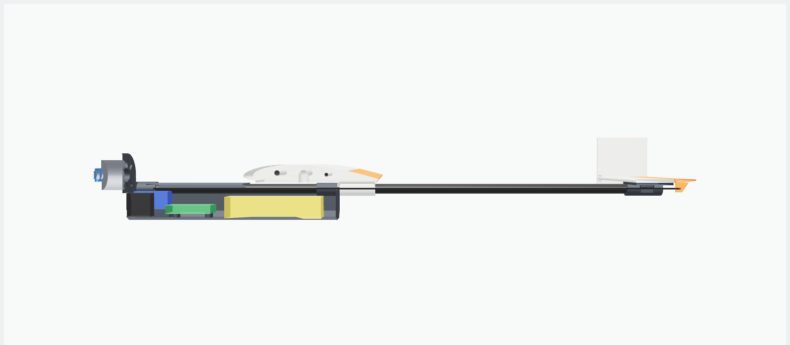

# Kipinä 400: twin-tube micro FPV plane


A 3D-printed fixed wing with a Molniya-style layout. Two plain round tubes are
the whole fuselage structure: they run from the motor to the tail and carry the
pod, the straight rectangular wing and an H-tail. It is a hobby FPV airframe
only. There is no payload bay or release mechanism, just a pod for the flight
battery and the FPV electronics.

The brief was "as small as possible". The size comes from a sweep, not a guess.
See [Why 400 mm](#why-400-mm).

| | |
|---|---|
| Wingspan | 400 mm, chord 80 mm, NACA 4412 at 2° incidence |
| Length | 363 mm (prop to elevator trailing edge) |
| Main struts | 2 × carbon tube 6×5 mm, 324 mm long, 40 mm apart |
| All-up weight | ~151 g (printed parts ~58 g) |
| Wing loading | 47 g/dm² |
| Stall / cruise | ~8.9 / ~13 m/s |
| Endurance | ~14 min on 2S 450 mAh (rough estimate) |
| CG | 94.8 mm behind the motor face = 22.4 mm behind the wing LE (28 % chord) |
| Static margin | ~15 % (neutral point at ~43 % chord) |

All numbers are first-order estimates from `design.py` and the CAD volumes.
Nothing here has been flight-tested yet. [REPORT.md](REPORT.md) has the full
mass breakdown and the print list, regenerated on every build.

| Top | Side cutaway |
|---|---|
|  |  |

## Why 400 mm

A printed plane does not scale down evenly. The electronics weigh the same at
any size, and a printed skin can't get thinner than one nozzle line. So as the
span drops, the wing loading and the stall speed climb.

`design.py` rebuilds the layout at each span, re-balances it (tail volumes, CG,
battery station) and estimates the weight. The criterion is a stall speed of
at most 9 m/s at CLmax 0.95, which keeps hand launches and FPV landings
comfortable.

| span | AUW | stall |
|---|---|---|
| 300 mm | 127 g | 10.9 m/s |
| 340 mm | 135 g | 9.9 m/s |
| 380 mm | 144 g | 9.2 m/s |
| **390 mm** | | **9.0 m/s (first to pass)** |
| **400 mm** | **148 g** | **8.8 m/s (built)** |
| 460 mm | 164 g | 8.1 m/s |

The build rounds up to 400 mm for margin. To go smaller, lighten the kit: a 2S
300 mAh pack and 5×4 mm tubes save about 10 g, which is worth roughly 20 mm
of span. Change `Kit` and `Params` in `design.py`, then rerun.

## Parts

### Printed (`stl/`, already in print orientation)

| file | material | orientation |
|---|---|---|
| `pod.stl` | PLA/PETG | Upright, open top up. 2 walls, 15 % infill |
| `lid.stl` | PLA/PETG | Flat, lips up |
| `wing_centre.stl` | LW-PLA | On its side. 0.6 mm walls, 8 % infill |
| `wing_R.stl`, `wing_L.stl` | LW-PLA | Standing on the root rib, brim. 1 wall, 0 % infill |
| `aileron_R.stl`, `aileron_L.stl` | LW-PLA | Flat. 1 wall, 0 % infill |
| `tail_mount.stl` | PLA/PETG | Plate face down |
| `stab.stl` | LW-PLA | Flat. 2 top / 2 bottom layers, 15 % infill |
| `elevator.stl` | LW-PLA | Top face down, horn up |
| `fin_R.stl`, `fin_L.stl` | LW-PLA | Outer face down |

The tallest part is a wing panel at 172 mm, and nothing is wider than 157 mm,
so everything fits a 180 × 180 × 180 mm bed. The masses assume LW-PLA foamed to
about 0.75 g/cm³. Plain PLA works, but it adds roughly 25 g to the wing and tail.

### Bought

| item | example spec | g |
|---|---|---|
| Main struts | 2 × carbon tube 6×5 mm, cut to 324 mm (6×0.5 aluminium also fits, +6 g) | 8.6 |
| Wing spars | carbon rod 3 mm and 2 mm, 390 mm each | 6.2 |
| Motor + prop | 1404 3800 KV, 4×2.5 two-blade | 11 |
| ESC | 12 A single, BLHeli_S | 3.5 |
| Flight controller | 20×20 wing FC with servo outputs (INAV) | 6 |
| Receiver | ELRS nano | 1.5 |
| FPV | nano camera (14 mm) + 25–200 mW VTX | 6 |
| Servos | 3 × 4 g class digital micro servo (~20 × 8.5 × 18 mm) | 13 |
| Battery | 2S 450 mAh LiPo (58 × 31 × 13 mm) | 27 |
| Small parts | 1 mm carbon pushrod, 2 micro control horns, hinge tape, 10 mm velcro strap, M2 screws | ~5 |

## Assembly

1. **Check the fits.** Tube holes are 6.2 mm and spar holes 3.2/2.2 mm for glued
   joints. Ream any tight hole with a drill bit by hand.
2. **Fit out the pod.** Screw the motor to the front plate with M2 screws from
   inside. The slots take 9×9 mm, 12 mm and 16 mm patterns. Glue the camera
   behind its window and stand the elevator servo in its cradle (horn up, at
   tube height). Screw the FC to the four bosses and stick the ESC to the
   left wall. Motor wires go through the slot beside the camera.
3. **Join the tubes.** Thread the wing centre's saddle onto both tubes. Push the
   tubes into the pod from the rear until they bottom out in the front sleeves,
   then slide the wing centre forward onto the rear sleeves. Glue everything
   with epoxy or thick CA.
4. **Build the wing.** Slide the 3 mm and 2 mm rods through the centre section
   and glue both panels on. Press the aileron servos into the pockets under the
   panels. They sit about 1 mm proud; tape over them. Their leads run through
   the wire channel into the pod.
5. **Hinge the ailerons.** Tape along the top surface. The bevel under the
   hinge line gives about 25° of up travel.
6. **Build the tail.** Glue the stabiliser onto the tail mount and push the fins'
   jaws onto the stabiliser tips. Hinge the elevator with tape on top. Push the
   tail mount onto the tube ends. Sight from behind to get it square to the
   wing, then glue.
7. **Fit the pushrod.** Run a 1 mm carbon rod with wire Z-bend ends from the
   servo horn, over the battery and through the tail mount guide, to the
   elevator horn.
8. **Balance.** Strap the battery through the floor slots and slide it until the
   plane balances 22 mm behind the wing LE (94.8 mm from the motor face). The
   nominal battery centre is 90 mm from the motor face, and the travel is
   82–98 mm.

The hatch lid rests on the tubes between the sleeves. Hold it with tape or two
3 mm magnets.

## First flights

- Throws: ailerons ±12°, elevator ±15°, 30 % expo. INAV in angle mode for the
  first launch.
- Hand-launch with a firm, level throw at about 70 % throttle.
- The prop hangs below the pod. Cut the throttle before touchdown and land on
  grass, or use a prop saver.
- The fins are fixed, as on the original layout. Roll comes from the ailerons,
  and INAV coordinates the turns.

## Regenerating

```sh
pip install cadquery trimesh
python3 airframe/design.py      # sizing sweep and layout, no CAD needed
python3 airframe/build.py       # STLs, STEP, GLB, REPORT.md

# optional: PNG previews from the three.js viewer (headless Chromium)
npm install three@0.169.0 playwright
node airframe/tools/render.mjs
```

Every dimension comes from `Params` and `Kit` in `design.py`: span, aspect
ratio, airfoil, tail volumes, tube size and spacing, pod depth, CG target. The
solver moves the wing along the tubes so the battery balances the plane in the
middle of its travel. It then sizes the tail from the volume coefficients.

- `cad/airframe.step` is the full assembly in flight position, with reference
  bodies for the electronics. Open it in Fusion, FreeCAD or SolidWorks.
- `viewer/index.html` is an interactive 3D viewer. Serve the `viewer/` folder
  over HTTP, for example with `npx http-server airframe/viewer`.

The coordinates are millimetres. x runs aft from the motor mounting face, y
towards the right wing tip and z up, with z = 0 on the tube centre-line.

## Known limitations

- The weights are estimates. LW-PLA density depends heavily on print
  temperature and flow. Weigh your parts and put the real numbers in
  `build.py` (`PRINT`) before trusting the CG.
- The aerodynamics are first-order: Helmbold lift slope, a Gilruth-style pod
  term and CLmax 0.95. Expect to trim.
- Servo, camera and FC sizes are generic. Check the pocket and cradle
  dimensions against the parts you buy.
