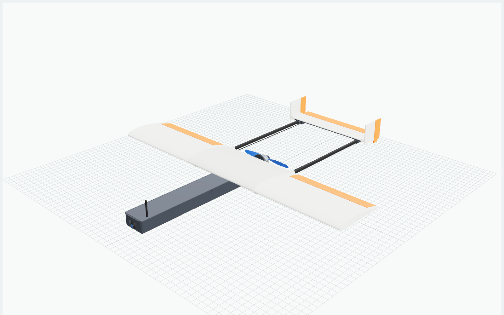
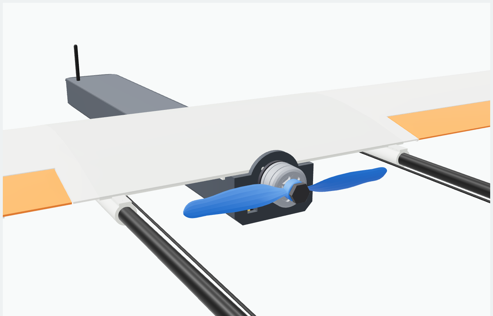
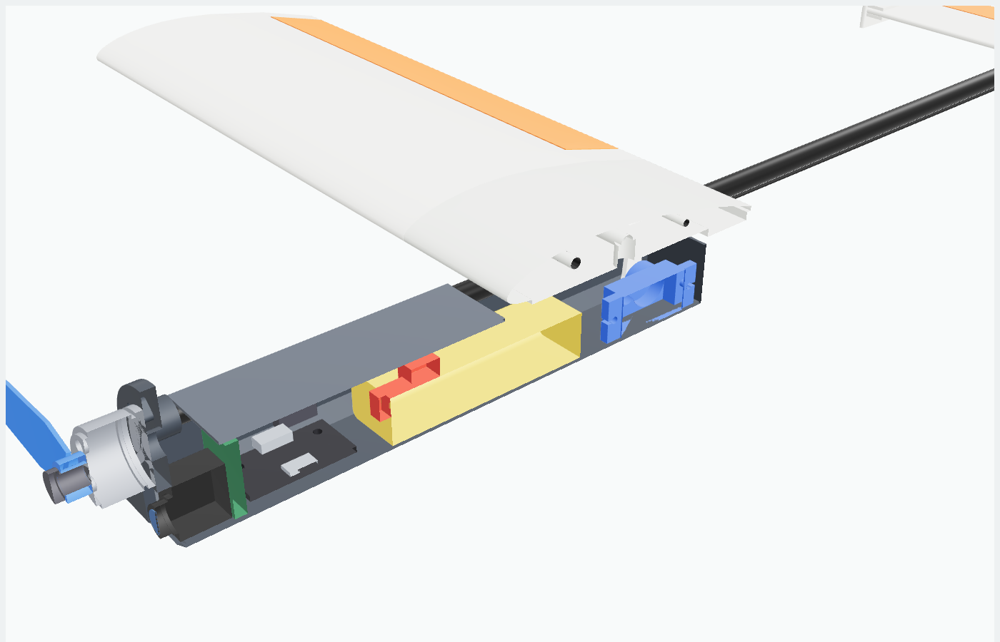
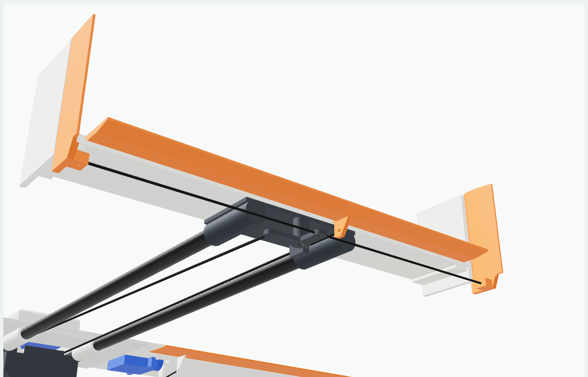
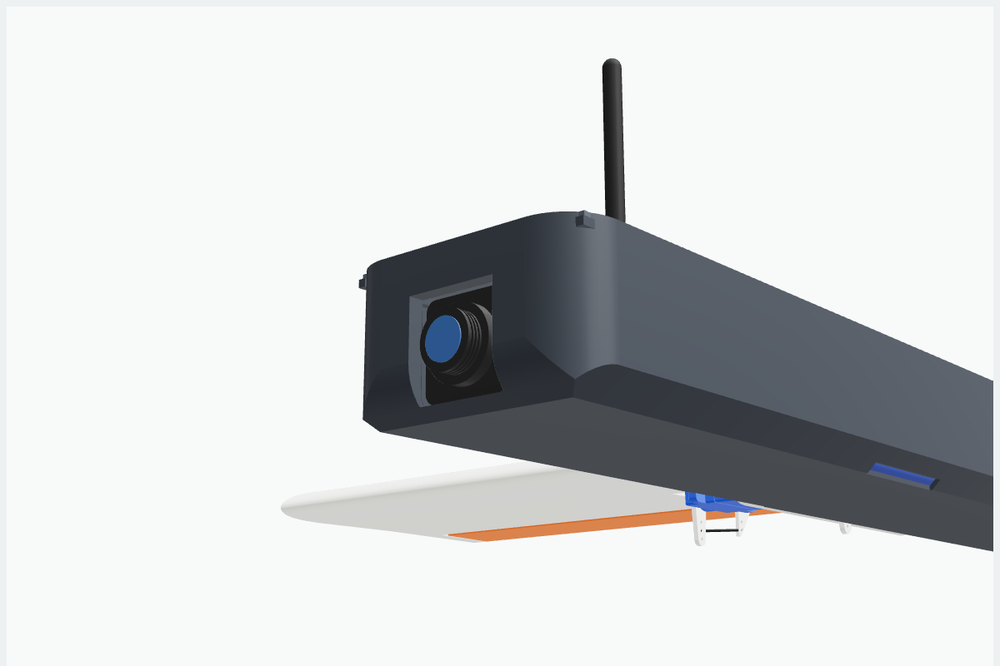
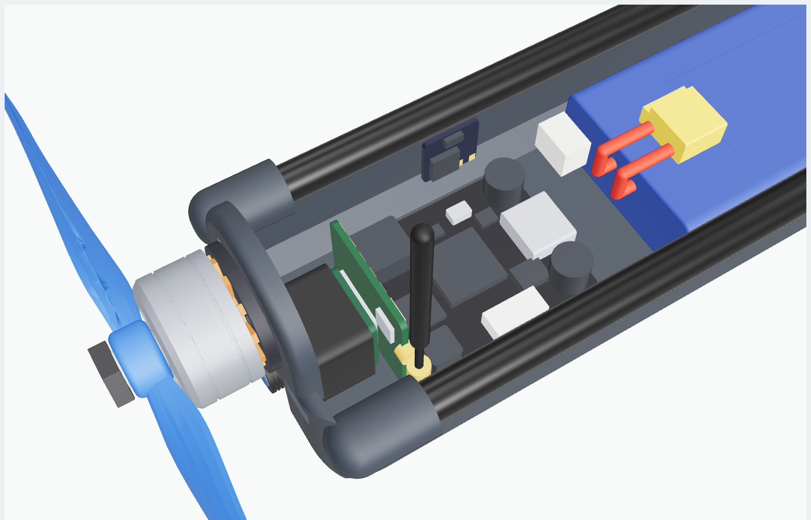
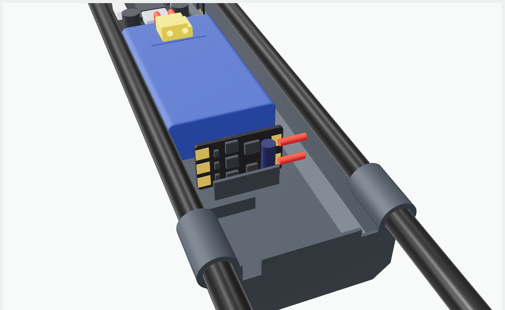
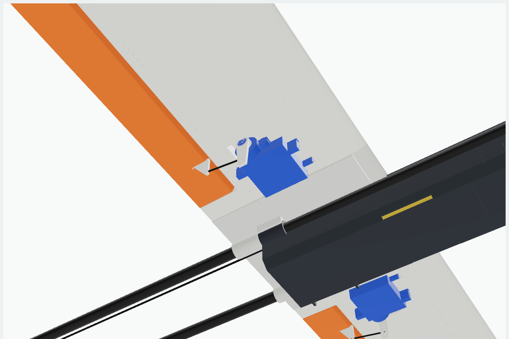
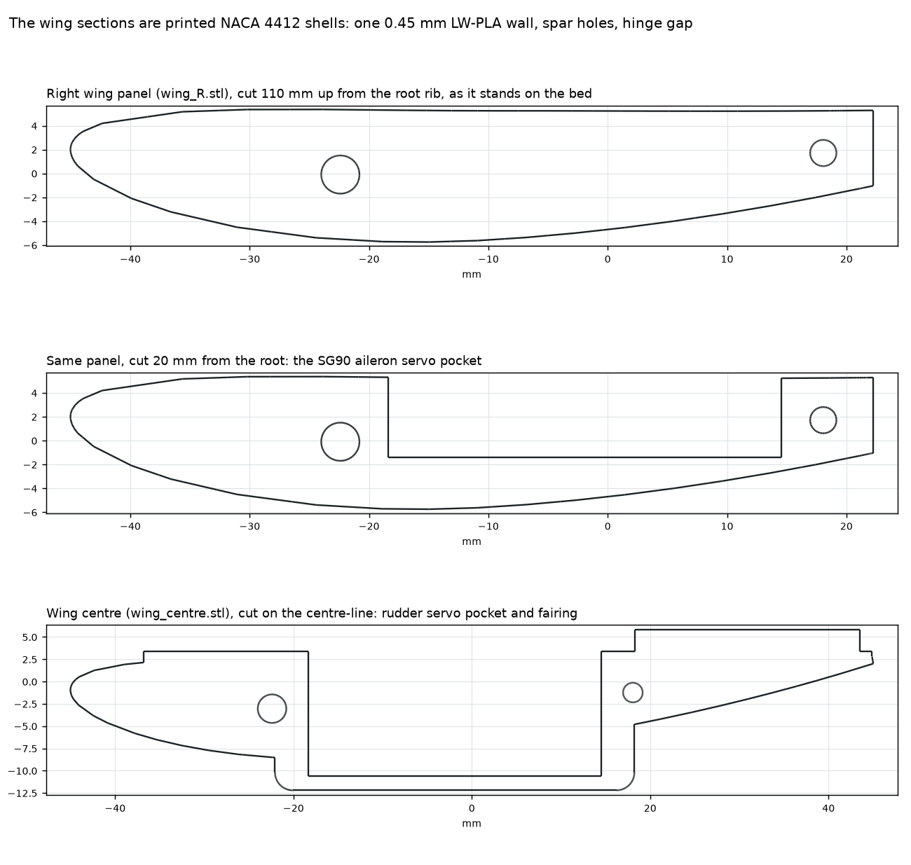

# Kipinä 485: twin-boom micro FPV pusher



A 3D-printed twin-boom pusher. A short pod carries the FPV camera in its nose,
the flight controller, battery and ESC behind it, and the motor on its back
wall. Two plain round carbon tubes, 140 mm apart, run from sockets under the
wing centre back to an H-tail, and the 4" prop turns between them. The camera
therefore has a clear view ahead, with no prop disc in front of it. It is a
hobby FPV airframe only. There is no payload bay or release mechanism, just a
pod for the flight battery and the FPV electronics.

The plane started as a Molniya-style twin-tube tractor, with the two tubes
40 mm apart under the pod and the motor on the nose. That put the camera
behind the prop. The tubes are now spread into tail booms far enough apart for
the prop to turn between them. See [Why a pusher](#why-a-pusher).

Four **SG90** servos give full three-axis control: one per aileron, one for the
elevator and one for the twin rudders. The brief was "as small as possible",
so the size comes from a sweep, not a guess. See [Why 485 mm](#why-485-mm).

| | |
|---|---|
| Wingspan | 485 mm, chord 97 mm, NACA 4412 at 2° incidence |
| Length | 504 mm (nose to elevator trailing edge) |
| Tail booms | 2 × carbon tube 6×5 mm, 298 mm long, 140 mm apart |
| Prop clearance | 16.2 mm from the blade tips to each boom, 10.7 mm to each pushrod |
| Controls | ailerons, elevator, twin rudders: 4 × SG90 |
| Flight controller, ESC | Matek F405-WMN (12 outputs, 2–6S), Hobbywing XRotor Micro 30A (2–4S) |
| All-up weight | ~223 g (printed parts ~98 g) |
| Wing loading | 47 g/dm² |
| Stall / cruise | ~8.9 / ~13 m/s |
| Top speed | ~19 m/s (69 km/h) level, estimated; prop pitch speed 86 km/h |
| Endurance | ~10 min on 2S 450 mAh (rough estimate) |
| CG | 199.6 mm behind the nose = 27.2 mm behind the wing LE (28 % chord) |
| Static margin | ~13 % (neutral point at ~41 % chord) |
| Printer | every part fits a Bambu Lab A1 mini (180 × 180 × 180 mm) |

All numbers are first-order estimates from `design.py` and the CAD volumes.
Nothing here has been flight-tested yet. [REPORT.md](REPORT.md) has the full
mass breakdown, the print list, the sizing check and the interference check,
regenerated on every build.

| Prop between the booms | Pod, cut open |
|---|---|
|  |  |

| Rudder linkage, from below | Rounded nose with the camera |
|---|---|
|  |  |

| Front bay: camera, VTX, F405-WMN, receiver | ESC by the back wall |
|---|---|
|  |  |

| Aileron SG90 under the wing | |
|---|---|
|  | |

## Why a pusher

In the tractor layout the camera sat 18 mm from the prop axis, well inside
the 101.6 mm prop disc, so a blade crossed the lens about 18 % of the time.
Moving the prop behind the pod fixes that. The catch is that the prop has to
turn somewhere: the old tubes were 40 mm apart, and a 4" prop is 101.6 mm
across.

So the tubes became tail booms:

- **Booms.** The booms start in two sockets under the wing centre and are
  140 mm apart (±70 mm). The blade tips pass 16.2 mm inside each boom.
- **Motor.** It is turned round and screwed to the pod's back wall, just
  behind the wing's trailing edge. The prop turns 18 mm behind the wing,
  on the boom centre-line.
- **Pushrods.** They run along the inside of the booms, 62 mm from the
  centre-line, 10.7 mm outside the blade tips. Tape them to the booms
  so they cannot bow into the disc.
- **Servos.** The elevator and rudder servos moved out of the pod into the
  wing centre, one on each side of the pod, with their horns on the pushrod
  lines.
- **Pod.** The pod no longer carries the tubes. It hangs under the wing
  centre, with the camera in its nose. The CG still has to sit at 28 % of the
  chord, and the motor now sits behind the wing, so the pod needs about
  170 mm of nose ahead of the wing. That makes it about 272 mm long,
  which is too long for the 180 mm bed. It prints in two halves joined by an
  8 mm tongue.

The cost is weight and span. The pusher is about 17 g heavier than
the tractor was (a longer pod, the boom sockets, a wider tail mount and longer
booms), and to stay under the 9 m/s stall limit the wing grew from 465 mm to
485 mm.

## Build process and DFMA

`process.py` turns the model into a **bill of process** ([BOP.md](BOP.md)) and a
**DFMA analysis** ([DFMA.md](DFMA.md)). The same data drives the viewer's
**Assemble** button and the video [preview/assembly.mp4](preview/assembly.mp4).

- **30 operations** in five groups:
  - 5 print jobs on the A1 mini;
  - 7 prep steps (cut carbon, make linkages, finish prints);
  - 16 assembly steps;
  - 2 setup steps.

  Each has its predecessors, tools, consumables and a time.
- **Print times are real slicer output.** They come from PrusaSlicer 2.7 on an
  A1-mini-like profile (`tools/a1mini.ini`): 8 h 38 min in total and
  97 g of filament. The wing centre takes 2 h 30 min and each wing panel
  1 h 24 min, because LW-PLA prints slowly.
- **Hand times are estimates.** They use Boothroyd–Dewhurst handling and
  insertion values plus shop times for gluing, soldering, taping and bending.
  Hands-on time is 1 h 46 min, including 32 min of INAV setup. Soldering is
  the biggest single item: the F405-WMN's servo, ESC and power connections are
  pads, so a full wiring pass is about 32 joints.
- **Schedule.** One builder works while one printer runs. That gives a lead
  time of **10 h 09 min**, and the critical path runs through the five
  prints in series.

| DFMA | |
|---|---|
| Parts and fasteners | 54 (theoretical minimum 26) |
| Manual assembly time | 42 min (7 min handling and insertion) |
| Design efficiency | 3% (19% counting handling and insertion only) |
| With the redesign suggestions | 46 parts, 32 min, 4% |
| Printability | no part needs support |
| Cost | about 170 EUR per airframe; the whole printed airframe is only 97 g of filament (about 4 EUR), but a first build also buys an LW-PLA and a PETG spool (about 65 EUR), so about 235 EUR up front |

Most of the assembly time goes into joints (solder, epoxy, CA, tape), not into
handling parts. The suggestions that save the most are:

- an FC with a built-in receiver;
- a camera with an integrated VTX;
- printed hinges;
- printing the tail as one piece.

DFMA.md lists each one with its trade-off.

## Why 485 mm

A printed plane does not scale down evenly. The electronics weigh the same at
any size, and a printed skin can't get thinner than one nozzle line. So as the
span drops, the wing loading and the stall speed climb.

`design.py` rebuilds the layout at each span, re-balances it (tail volumes, CG,
battery station) and estimates the weight. A span passes when:

- the stall speed is at most 9 m/s at CLmax 0.95, which keeps hand launches and
  FPV landings comfortable, and
- an SG90's 32.3 mm mounting tabs fit between the two wing spars. That needs a
  chord of at least about 80 mm.

| span | AUW | stall |
|---|---|---|
| 300 mm | 172 g | 12.7 m/s |
| 380 mm | 191 g | 10.6 m/s |
| 440 mm | 207 g | 9.5 m/s |
| 460 mm | 213 g | 9.2 m/s |
| **480 mm** | **219 g** (estimate) | **8.95 m/s (first to pass the quick estimate)** |
| 480 mm | 221 g (CAD) | 9.00 m/s (exactly on the limit) |
| **485 mm** | **223 g (CAD)** | **8.94 m/s (built)** |

The quick estimate is a couple of grams light. With the CAD weights, which
include the printed detail and the wiring, 480 mm lands exactly on the limit,
so the build takes the next 5 mm step, which keeps a little margin.

Yaw control costs about 11 g: a fourth SG90, two printed rudders and the
linkage. Without rudders (`Params.rudders = False`) the sweep lands at
460 mm. The four SG90s are the heaviest part of the kit after the
battery; a 4 g servo such as the Emax ES9051 would bring the span down, but it
needs new pockets. Change `Kit` and `Params` in `design.py` and rerun to try
other parts.

## Yaw control

Each fin carries a rudder aft of the elevator hinge line, about a third of
the fin area, hinged with tape on the outboard face.

- **Servo.** The rudder SG90 lies on its side in the wing centre, left of the
  pod, with its shaft pointing left. Its horn hangs below the wing, 62 mm left
  of the centre-line.
- **Pushrod.** A 1 mm carbon rod runs from the servo horn back along the
  inside of the left boom to the tail.
- **Bellcrank.** A printed 90° bellcrank pivots on an M2 screw under the tail
  mount, 49 mm left of the centre-line. The pushrod drives its outer arm, and
  its rear arm moves side to side.
- **Joiners.** Two 0.8 mm steel wires run from the bellcrank's rear arm to a
  horn tab under each rudder, below the fins and the tail mount, so both
  rudders always move together.

The elevator servo is the mirror image on the right. Its pushrod runs along
the inside of the right boom, through a guide on the tail mount, to the
printed elevator horn.

## Parts

### Printed (`stl/`, already in print orientation)

| file | material | on the bed, mm | orientation |
|---|---|---|---|
| `pod_front.stl` | PLA/PETG | 138 × 41 × 22 | Upright, open top up. 2 walls, 15 % infill |
| `pod_rear.stl` | PLA/PETG | 142 × 41 × 31 | Upright, open top up, tongue forward. 2 walls, 15 % infill |
| `lid.stl` | PLA/PETG | 177 × 39 × 1 | Flat |
| `wing_centre.stl` | LW-PLA | 105 × 22 × 155 | On its side. 0.5 mm walls, 5 % infill |
| `wing_R.stl`, `wing_L.stl` | LW-PLA | 97 × 12 × 165 | Standing on the root rib, brim. 1 wall, 0 % infill |
| `aileron_R.stl`, `aileron_L.stl` | LW-PLA | 24 × 148 × 7 | Flat. 1 wall, 0 % infill |
| `tail_mount.stl` | PLA/PETG | 31 × 156 × 9 | Pads face down |
| `stab.stl` | LW-PLA | 31 × 174 × 2 | Flat. 2 top / 2 bottom layers, 15 % infill |
| `elevator.stl` | LW-PLA | 17 × 163 × 10 | Top face down, horn up |
| `fin_R.stl`, `fin_L.stl` | LW-PLA | 30 × 39 × 9 | Outer face down |
| `rudder_R.stl`, `rudder_L.stl` | PLA/PETG | 17 × 44 × 6 | Outer face down, wire flange up |
| `bellcrank.stl` | PLA/PETG | 16 × 19 × 2 | Flat, solid |

Every wing piece is a printed NACA 4412 section: a closed one-wall LW-PLA shell
with the spar holes, servo pockets and hinge gap built in.



The masses assume LW-PLA foamed to about 0.75 g/cm³. Plain PLA works, but it
adds roughly 25 g to the wing and tail. The pod, rudders and bellcrank are
plain PLA or PETG because they take the motor and linkage loads.

### Printing on a Bambu Lab A1 mini

Everything fits the A1 mini's 180 × 180 × 180 mm volume. `Params.bed` holds
the build volume, and the model adapts to it:

- the stabiliser's span is capped at the bed width, with its chord widened to
  keep the same area;
- the pod is split into two halves, each shorter than the bed.

Every build checks each part against the volume (see the print list in
REPORT.md).

Five plates cover the whole airframe:

| plate | parts | material |
|---|---|---|
| 1 | both pod halves, lid, tail mount, both rudders, bellcrank | PETG or PLA |
| 2 | wing centre, both fins | LW-PLA |
| 3 | stabiliser, elevator, both ailerons | LW-PLA |
| 4 | right wing panel | LW-PLA |
| 5 | left wing panel | LW-PLA |

Plates 1, 2 and 3 mix different wall and infill settings, so set them per
object in Bambu Studio.

- **Tall wing panels.** The A1 mini moves its bed front to back, which shakes
  tall, thin parts. Turn each panel so its chord runs front to back, add an
  8–10 mm brim, and print at reduced speed (Silent mode).
- **LW-PLA** is not a Bambu filament, so make a custom filament profile. A
  starting point: about 240 °C with the flow at 55–60 %, little or no
  retraction. Print a test cube, weigh it and adjust the flow until the density
  is near 0.75 g/cm³. The hotend reaches these temperatures without upgrades.
- **Plain PLA** prints with the stock profile if you want to skip LW-PLA for a
  first test airframe.

### Electronics

Everything below is modelled in `cad/airframe.step` (the `electronics` and
`hardware` groups) and in the CG calculation. The pod bays are sized for these
dimensions, so check sizes before substituting parts.

| part | spec | requirements | g |
|---|---|---|---|
| Servos | 4 × Tower Pro SG90: 4.8–6 V, ~1.8 kg·cm, 0.1 s/60° | 22.8 × 12.2 × 22.7 mm body, 32.3 mm across the tabs | 36 |
| Motor | 1404 outrunner, 3000–3800 KV | Rated for 2S; ≥ 223 g static thrust on a 4" prop (1:1). 9×9, 12 or 16 mm mounting | 9 |
| Prop | 4" two-blade, 2.4–2.5" pitch (Gemfan 4024 class) | Hub to match the motor shaft; see the pusher note below | 2 |
| ESC | **Hobbywing XRotor Micro 30A**: BLHeli_S, 2–4S, 30 A continuous / 40 A burst, no BEC | 23.8 × 14.5 × 5.8 mm, 20 AWG input wires, solder tabs for the motor. Full-throttle draw is about 8 A, so it runs at about a quarter of its rating | 6 |
| Flight controller | **Matek F405-WMN**, INAV or ArduPilot | 31 × 26 mm on four 2 mm holes, 22 × 22 mm pattern; the vendor quotes 16.5 mm height, which the pod reserves. 2–6S input, 12 outputs, 5 A servo BEC (5 or 6 V), 1.5 A logic BEC, 132 A current sensor, analog OSD, 5 UARTs, barometer, USB-C. Battery, servo and ESC connections are pads on the underside | 10 |
| Receiver | ExpressLRS 2.4 GHz nano | CRSF to an FC UART | 1.5 |
| Camera | analog nano, 14 mm (Caddx Ant / RunCam Nano class) | 14 × 14 mm body, ≤ 12 mm deep | 3.3 |
| VTX | 5.8 GHz analog, 25–200 mW | ≤ 20 × 19 × 3 mm, MMCX antenna socket; the F405-WMN has no 9 V supply, so it runs from the switched battery output (2S) or the 5 V BEC. Whip antenna coax through the lid | 4.2 |
| Battery | 2S 450 mAh LiPo, ≥ 30C, XT30 | ≤ 58 × 31 × 13 mm | 27 |

**Pusher prop.** The motor faces backwards, so the prop must still push air
aft. Either mount a normal prop with its lettered face towards the nose and
reverse the motor direction in the ESC (or swap two motor wires), or use the
reverse-rotation version of the same prop. Check on the bench, without the
prop first and then with it held down, that the air blows backwards. Use a
nyloc prop nut: a reversed motor can loosen a self-tightening one.

Some electrical numbers from the model (`design.py`), all first-order:

- **Cruise:** about 2.1 A, which gives about 10 minutes on the
  450 mAh pack with 20 % held in reserve.
- **Full throttle:** about 8 A at 1:1 thrust. That is about 18C from the pack
  and a quarter of the ESC's 30 A rating.
- **Servo supply:** four SG90s can together draw well over an amp when they
  stall or buzz. The F405-WMN's 5 A servo supply covers that; leave it at 5 V.

GPS is not included. An M10 module adds about 5 g, which raises the stall
speed by about 0.1 m/s, just past the sizing limit. That is fine once you know
the plane; otherwise build the wing 10 mm wider.

### Electronics that carry over to a bigger wing

The F405-WMN and the XRotor Micro 30A were picked so the same boards can move
to a larger plane later:

| | in this plane | in a bigger wing |
|---|---|---|
| Flight controller | motor + 4 servos, 2S | 12 outputs, 2–6S input, 5 A servo supply: room for 5 or 6 small servos, or 3 or 4 larger ones, plus GPS and a compass on the spare UARTs |
| ESC | about 8 A on 2S | 30 A continuous on 2–4S: fine for a motor that draws up to about 25 A |
| Limit | | The ESC stops at 4S. A 6S plane needs a bigger ESC, and the FC can stay |

### How detailed the bought-part models are

`components.py` builds every bought part as a recognisable solid, in its own
colour group so the viewer and the STEP file can show and move them
separately. The outer sizes come from datasheets or retailer listings. The
detail inside those envelopes is representative, not a copy of a drawing.

- **SG90:** case seams, a label recess, rounded mounting tabs with keyhole
  slots, a lead grommet with three wires, and a horn with a rounded tip and a
  centre screw.
- **Motor 1404:** a black base with the 9 × 9 mm screw holes, a copper 12-tooth
  stator visible in the gap, a chamfered bell with six vent slots and two
  grooves, the shaft and a hex prop nut.
- **Prop 4 × 2.5:** twisted, cambered blades lofted through ten stations. The
  pitch angle follows the local radius and the roots are narrow, so the blades
  clear the motor bell. In the pusher it is the mirror image of the tractor
  prop.
- **Camera:** rounded housing, threaded lens barrel with a glass disc, and a
  PCB with three pads.
- **VTX:** a 20 × 19 mm card with a shield on each side, a row of pads and an
  MMCX socket. The whip's gold plug clips on the socket and its coax passes
  through a 2 mm hole in the lid.
- **Matek F405-WMN:** the F405, IMU, barometer, OSD chip and flash, two BEC
  inductors, two capacitors, a USB-C socket, the DFU button, a JST-SH port and
  the pads on the underside. The vendor's 16.5 mm height is kept as a clearance
  envelope for the interference check; the modelled parts are lower.
- **XRotor Micro 30A:** MOSFETs on both sides, a low-profile capacitor lying
  across the top, battery and motor pads and two short red and black input
  wires. The card stands on edge between two printed ribs.
- **Battery:** a label recess, red and black leads that fold over the top to a
  keyed XT30 with pin holes, and a JST-XH balance plug.

### Also needed

| item | spec | g |
|---|---|---|
| Tail booms | 2 × carbon tube 6×5 mm, cut to 298 mm (6×0.5 aluminium also fits, heavier) | 8.0 |
| Wing spars | carbon rod 3 mm and 2 mm, 475 mm each | 7.5 |
| Pushrods | 2 × 1 mm carbon rod (~265 mm) with wire Z-bend ends: elevator and rudder | 1 |
| Wire | 0.8 mm steel: 2 aileron links, 2 rudder joiners | ~1 |
| Small parts | 2 micro control horns, M2 screws (4 for the motor, 4 for the FC, one for the bellcrank), hinge tape, 10 mm velcro strap | ~2 |

## Assembly

1. **Check the fits.** Boom holes are 6.2 mm and spar holes 3.2/2.2 mm for
   glued joints. Ream any tight hole with a drill bit by hand.
2. **Glue the pod halves.** Slide the rear half's U-shaped tongue 8 mm into
   the front half, check that the floor and top edges line up, and glue with
   CA.
3. **Fit out the pod.**
   - Screw the motor to the back wall with M2 screws from inside the pod. The
     slots take 9×9 mm, 12 mm and 16 mm patterns. The motor wires go straight
     through the slot beside the shaft, so the stock wire length is enough.
   - Glue the camera behind the window in the nose and stand the VTX board
     right behind it. The whip antenna goes up through the hole in the lid.
   - Solder the FC's wires first: its battery, servo and ESC connections are
     pads on the underside. Then screw it to the four posts (22 × 22 mm hole
     pattern, M2 self-tapping screws) with its long edge along the pod. Stick
     the receiver to the right wall, about 3 mm above the floor so it clears
     the belly chamfer.
   - Drop the ESC into the two ribs in front of the back wall, on edge across
     the pod, with its motor tabs to the left and its battery wires to the
     right.
4. **Fit the elevator and rudder SG90s** in the wing centre before it goes on
   the pod.
   - Press each one into its pocket from below: tabs between the spars, shaft
     pointing outboard, the elevator servo on the right and the rudder servo
     on the left.
   - Point each horn straight down, below the wing. The horns are used full
     length; hook the pushrod into the hole about 8 mm from the shaft, which
     keeps the pushrod level with the booms.
5. **Join the frame.** Glue the pod under the wing centre between the two
   locating rails. Push the booms into their sockets from behind until they
   bottom out, and glue everything with epoxy or thick CA.
6. **Build the wing.**
   - Slide the 3 mm and 2 mm rods through the centre section and glue both
     panels on.
   - Each aileron SG90 lies on its side in the pocket under its panel: tabs
     between the spars, shaft pointing at the tip, horn hanging down. About
     3 mm of the servo stands proud of the lower surface.
   - All servo leads run through the wire channel and down into the pod.
7. **Hinge and link the ailerons.**
   - Tape the hinge along the top surface. The bevel under the hinge line gives
     about 25° of up travel.
   - Glue a micro control horn into the slot under each aileron.
   - Link it to the servo horn (11.5 mm hole) with 0.8 mm Z-bend wire.
8. **Build the tail.**
   - Glue the stabiliser onto the tail mount and push the fins' jaws onto the
     stabiliser tips.
   - Hinge the elevator with tape on top.
   - Hinge each rudder to the back of its fin with tape on the outboard face.
     The horn tab goes at the bottom.
   - Screw the bellcrank loosely under the tail mount with an M2 screw, so it
     turns freely.
   - Push the tail mount onto the boom ends. Sight from behind to get it square
     to the wing, then glue.
9. **Fit the pushrods.**
   - Elevator: from the right servo horn, along the inside of the right boom
     and through the tail mount guide, to the printed elevator horn.
   - Rudder: from the left servo horn, along the inside of the left boom, to
     the bellcrank's outer arm.
   - Tape each pushrod loosely to its boom in two places, as a guide. They
     pass only 10.7 mm outside the prop disc and must not bow into it.
   - Bend both joiner wires with an L at each end. Drop one end into the
     bellcrank's rear arm and the other into the flange under each rudder, and
     adjust them so both rudders sit straight with the servo centred.
10. **Balance.** Strap the battery through the floor slots and slide it until
    the plane balances 27.2 mm behind the wing LE (199.6 mm from the nose).
    The nominal battery centre is 91 mm from the nose, and the travel is
    83–99 mm. The XT30 folds back over the top of the pack.

The hatch lid sits flush on two ledges and runs from the nose to just under
the wing's leading edge. Hook its back edge under the wing, press the front
down, and hold it with tape or two 3 mm magnets.

## First flights

- **Throws:** ailerons ±12°, elevator ±15°, rudders ±20° (set with the servo
  endpoints), 30 % expo.
- **INAV setup:** use the Airplane mixer with a rudder output, and fly angle
  mode for the first launch. Set the motor direction as described in the
  pusher note above.
- **Launch:** the prop is behind your hand. Hold the pod ahead of the wing
  from below, keep your fingers well forward of the trailing edge, and throw
  firmly and level at about 70 % throttle. A launch glove is a good idea.
- **Landing:** the prop disc reaches about 33 mm below the pod's belly. Cut the
  throttle before touchdown and land on grass, or use a prop saver.
- **Rudder:** use it to coordinate turns and hold heading in crosswinds. Check
  the rudder direction on the bench, and reverse the servo in INAV if needed.

## Regenerating

```sh
pip install cadquery trimesh
python3 airframe/design.py      # sizing sweep and layout, no CAD needed
python3 airframe/build.py       # STLs, STEP, GLB, REPORT.md, sizing + interference checks

python3 airframe/process.py     # BOP.md, DFMA.md, viewer/process.json (slices with prusa-slicer if installed)

# optional: PNG previews and the assembly video from the three.js viewer (headless Chromium)
npm install three@0.169.0 playwright
node airframe/tools/render.mjs
node airframe/tools/render.mjs --video --ffmpeg /path/to/ffmpeg
```

The code is split into four files:

- `design.py` holds every dimension (`Params`), the electronics (`Kit`) and the
  SG90 datasheet dimensions (`Servo`).
- `build.py` makes the printed parts.
- `components.py` models the bought parts in detail (see above).
- `geom.py` holds the shared solid helpers.

Each build:

- moves the wing along the pod until the battery balances the plane in the
  middle of its travel, using the CAD masses,
- checks the stall speed with the CAD weight,
- checks every bought part against every other body for overlaps, and
- checks every printed part against the printer's build volume.

- `cad/airframe.step` is the full assembly in flight position, in three groups:
  `printed`, `hardware` and `electronics`. Open it in Fusion, FreeCAD or
  SolidWorks.
- `viewer/index.html` is an interactive 3D viewer. Serve the `viewer/` folder
  over HTTP, for example with `npx http-server airframe/viewer`.

The coordinates are millimetres. x runs aft from the pod's nose, y towards the
right wing tip and z up, with z = 0 on the boom centre-line.

## Drag

[`aero/`](../aero/README.md) has a simple air-resistance optimizer that runs on
this design (`python3 aero/optimize.py airframe`). With the span held at the
brief's smallest passing size, the rest of the sizing is pinned by the stall
limit, the SG90 tabs and the bed. It finds about 20 % less drag from small
changes to the details: a rounded top front edge on the pod, the rudder
joiners in a groove, horn fairings, a tapered pod rear and a laid-back
antenna. See [aero/REPORT_airframe.md](../aero/REPORT_airframe.md).

The efficiency study (`python3 aero/efficiency.py`) goes further on the wing.
It reshapes the NACA 4412 with NeuralFoil for the plane's own lift and
Reynolds numbers, keeping the spars, the servo, the printable trailing edge
and the stall. That cuts the wing's profile drag by about 20 % at cruise.
Together with the detail changes, the flight time at 13 m/s rises from 13.3
to 16.9 min. The charts are in
[aero/study/index.html](../aero/study/index.html) and the airfoil in
[aero/study/kipina-opt.dat](../aero/study/kipina-opt.dat).

## Known limitations

- The weights are estimates. LW-PLA density depends heavily on print
  temperature and flow. Weigh your parts and put the real numbers in
  `build.py` (`PRINT`) before trusting the CG.
- The aerodynamics are first-order: Helmbold lift slope, a Gilruth-style pod
  term and CLmax 0.95. Expect to trim.
- The prop works in the wake of the pod and the wing. That usually costs a
  pusher a few percent of thrust and makes it a little louder. The model
  ignores it.
- The SG90 model uses datasheet dimensions. Clones vary by a few tenths of a
  millimetre, so test-fit a servo in the pocket before gluing.
- The drag build-up (top speed, the nose's benefit) uses handbook drag
  coefficients for the pod front. At this size (Reynolds number around 40 000)
  they could be off by ±50 %; the comparison between options is more
  reliable than the absolute numbers.
- The FC and ESC outer sizes come from retailer listings, because the
  makers' drawings were not reachable. Check the FC's 22 × 22 mm hole pattern,
  its height and the pad positions against your board before printing the
  pod. The camera, VTX and receiver sizes are generic.
- The booms are only held by their glued sockets under the wing centre and
  the tail mount. That is enough for the loads of a 200 g plane, but a hard
  cartwheel will load the sockets; check them after crashes.
