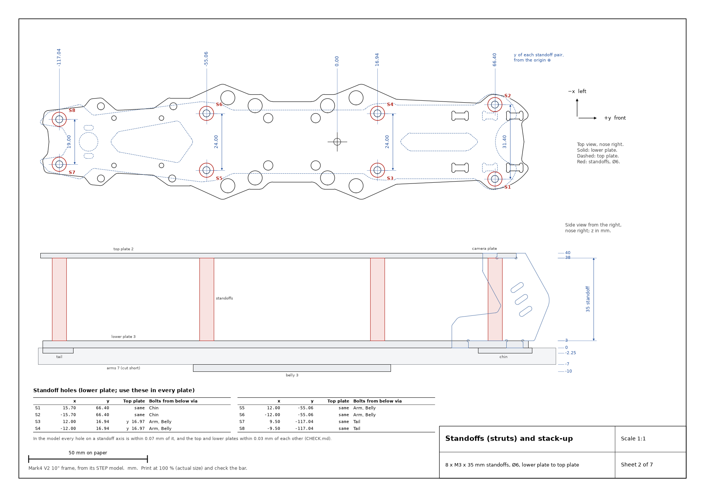

# Mark4 V2 10" frame: 2D drawings from its STEP model



Exact 2D profiles and dimensioned drawings of every part in a Mark4 V2 10"
FPV frame, so it can be remodelled, cut or printed. They come straight from a
STEP model of the frame (`source/mark4_v2_10in.step`, a FreeCAD/Ondsel export
named "Mark 4 V2 10in"). Each part is a flat plate, so `build.py` cuts it
through its thickness and writes that outline exactly as modelled. Nothing is
redrawn or rounded off. Every DXF re-imports with the same area and the same
hole positions as the STEP part, to 0.0001 mm.

The parts match the RJX Mark4 V2 10" assembly manual: top plate, mid (lower)
plate, bottom (belly) plate, front (chin) and back (tail) plates, four arms,
two arm bracers, two camera plates and eight M3 × 35 mm Ø6 standoffs.

| File | What it is |
|---|---|
| [`drawing.pdf`](drawing.pdf) | 7 A4 sheets: overview, standoffs and stack-up, then every part at 1:1 with a hole table. Print at 100 %. |
| `dxf/<part>.dxf` | One profile per part, mm, layer `PROFILE`. Extrude it by the part's thickness. Chin and tail plates also have a `COUNTERSINK` layer. |
| `dxf/assembly_top.dxf` | Every horizontal part and the 8 standoffs overlaid as assembled, one layer each: a quick check that the holes line up. |
| [`holes.csv`](holes.csv) | Every hole and slot of every part, with coordinates and diameters. |
| [`CHECK.md`](CHECK.md) | Standoff alignment through the stack, model quirks, and which print beds each part fits. |
| `sheets/*.png` | The drawing sheets as images. |
| `trace/<part>.png` | Each part alone, black on white, with its overall width and height, at exactly 10 px/mm: import as a Sketch Picture in SolidWorks, scale to a dimension and trace. (`trace_images.py`) |

## Coordinates

All coordinates are the STEP model's own, in mm. **x** runs to the right, **y**
forward and **z** up. The origin is on the centreline, and z = 0 is the
underside of the lower plate. Each horizontal part's DXF keeps its assembly x,
y position. So the standoff holes have the same coordinates in every plate,
and each extruded part placed at its z rebuilds the frame. The camera plate's
DXF is in its own plane: y forward, z up.

## Standoffs (struts)

Eight M3 × 35 mm standoffs, Ø6, stand on the lower plate (z 3) and carry the
top plate (z 38). These are the hole centres in the lower plate. Use them in
every plate:

| | x | y | Bolted from below through |
|---|---:|---:|---|
| S1, S2 | ±15.70 | 66.40 | chin plate (Ø2.8, countersunk), lower plate |
| S3, S4 | ±12.00 | 16.94 | belly plate, front arm, lower plate |
| S5, S6 | ±12.00 | −55.06 | belly plate, rear arm, lower plate |
| S7, S8 | ±9.50 | −117.04 | tail plate (Ø2.8, countersunk), lower plate |

Pair widths are 31.40, 24.00, 24.00 and 19.00 mm. In the model, the top
plate's S3/S4 holes sit 0.03 mm further forward (y 16.97). Every other
standoff hole in the top plate matches the lower plate. Through the whole
stack, every hole on a standoff axis sits within 0.07 mm of it. That is well
inside CNC or print tolerance (see [CHECK.md](CHECK.md)).

| Stack-up (z, mm) | from | to | thickness |
|---|---:|---:|---:|
| top plate | 38 | 40 | 2 |
| standoffs | 3 | 38 | 35 |
| camera plates (tabs through both plates) | 0 | 40 | 2.5 |
| lower plate | 0 | 3 | 3 |
| arm braces (on top of the arms) | 0 | 2 | 2 |
| chin and tail plates | −2.25 | 0 | 2.25 |
| arms | −7 | 0 | 7 |
| belly plate | −10 | −7 | 3 |

## Check before you rely on it

- **Wheelbase.** The model's motor centres are at x ±173.36, y 119.42 and
  −157.59: 346.7 mm side to side, 277.0 mm front to back and **443.8 mm**
  diagonally. RJX lists its Mark4 V2 10" at 427 mm, so this model's arms are
  longer than RJX's. If your frame measures 427, the arms differ; the centre
  plates and standoffs don't depend on the arms.
- **Thicknesses.** The model's arms are 7 mm thick. RJX lists 7.5 mm.
- **Lower plate, rear 30.5 mm pattern** (H13, H14, H19, H20). These holes aren't
  square or centred on x = 0: the left pair is at x −15.00, the right at
  x 15.50, and one hole is 0.5 mm off in y. They are drawn as modelled.
- **Ø2.8 holes in the chin and tail plates** are under M3 size. Open them to
  3.2 mm for an M3 countersunk screw.

## Printing it

Every part fits a 180 × 180 mm bed (a Bambu Lab A1 mini) when turned
diagonally. The arm needs 166.7 mm, the largest of any part (CHECK.md lists
them all). A printed 10" frame is much more flexible than carbon, so keep the
outlines and hole positions and thicken the parts:

- **Arms:** 7 mm carbon → 12 mm or more in PA-CF or PETG-CF. Arms are what
  vibrate, so if you can, keep these in carbon and print only the plates.
- **Lower and belly plates:** 3 mm → 5 mm. **Top plate:** 2 mm → 3–4 mm.
- **Standoffs stay 35 mm.** They span the gap between the lower and top
  plates, whatever thickness the plates are. Each bolt gets longer by however
  much you thicken the parts it passes through.
- **Press nuts:** the model has Ø6 holes at the press-nut positions in the
  lower plate. For a printed plate, size these holes for M3 heat-set inserts
  instead.

## Regenerate

```
pip install cadquery matplotlib
python3 frames/mark4-v2-10/build.py            # or --step path/to/another.step
```
