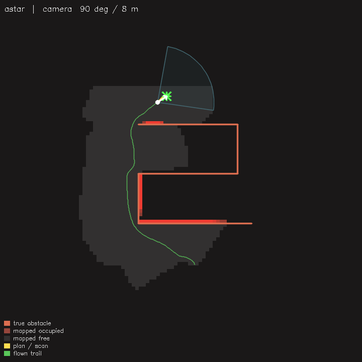

# nav-sim — a path-planning testbench

A small, self-contained desktop simulator for **comparing path-planning methods**
on a drone driving to a goal through obstacles, over an occupancy grid it builds
from its own forward scan as it moves (partial observability → replanning).

It is deliberately standalone: no dependency on any other project, no GPU, no
ROS. OpenCV is the only dependency (for image ops + optional visualization).



## What it does

A kinematic drone starts at the origin and must reach a (random or fixed) goal.
Each tick it casts a forward range scan, integrates a **log-odds occupancy grid**,
runs the selected **planner** on the latest (partial) map, and follows the plan
with a lookahead + a reactive slow-down. Everything is measured against ground
truth: did it reach the goal, did it keep standoff, how long was the path, how
long did planning take.

## Planners

Ten methods across the main planning families:

| name | family | method | character |
|---|---|---|---|
| `wavefront` | grid search | BFS flood from the goal + gradient descent | complete, near-optimal, floods the whole grid every tick (slow) |
| `dijkstra`  | grid search | 8-connected weighted search from the start | complete, near-optimal, faster than wavefront |
| `astar`     | grid search | Dijkstra + octile heuristic | complete, near-optimal, fast |
| `greedy`    | grid search | best-first on heuristic only (ignores cost) | fastest expansions, suboptimal, can be led astray |
| `weighted-astar` | grid search | A* with inflated heuristic (w=2.5) | faster than A*, bounded-suboptimal |
| `theta*`    | grid search | any-angle A* (line-of-sight parent shortcut) | shortest/smoothest paths, not locked to 8 directions |
| `potential` | reactive | attractive-to-goal + repulsive-from-obstacles | near-free, traps in local minima |
| `rrt`       | sampling | random tree growth with goal bias | scales to open space, jagged, jittery under replanning |
| `rrt*`      | sampling | RRT + choose-parent + rewire | better paths than RRT, much costlier per plan |
| `bug2`      | reactive | m-line seek + boundary follow (stateful) | cheap; works on simple boundaries, fragile on complex ones |

**No planner wins everywhere** — that's the point of the testbench. Across
arenas and seeds: the complete grid searches (`wavefront`/`dijkstra`/`astar`)
are the most robust; the heuristic and any-angle variants (`greedy`,
`weighted-astar`, `theta*`) trade robustness for speed or path quality and can
wedge under partial observability; `rrt*` finds better paths than `rrt` but pays
~100x the plan time; the reactive methods (`potential`, `bug2`) are the cheapest
but fail on complex or concave maps. Run `--compare` on different `--world` and
`--seed` values to see it flip.

## Build

```bash
cmake -B build && cmake --build build -j4     # needs OpenCV (core imgproc imgcodecs [highgui])
```

`highgui` is optional — without it everything works headless and `--save=<dir>`
still dumps PNGs.

### Windows

No code changes are needed — it builds to an `.exe`. Three options:

1. **Prebuilt exe, zero local setup** — a GitHub Actions workflow
   (`.github/workflows/nav-sim-windows.yml`) builds `nav_sim.exe` on every push.
   Grab it from the repo's **Actions** tab → latest *build nav-sim (Windows exe)*
   run → **Artifacts** → `nav_sim-windows-x64` (exe + the OpenCV DLLs it needs).
2. **MSYS2** (one package manager gets compiler + CMake + OpenCV): in the
   *MSYS2 UCRT64* shell, `pacman -S mingw-w64-ucrt-x86_64-{gcc,cmake,opencv}`,
   then `cmake -B build -G "MinGW Makefiles" && cmake --build build`. Run the
   exe from that shell so the DLLs are on PATH.
3. **VS Code**: install the *C/C++* and *CMake Tools* extensions, open this
   `nav-sim` folder, build (`F7`), then `F5` — the `.vscode/` configs run it
   with sensible args (`--world=maze --planner=astar --display`).

## Run

```bash
./build/nav_sim --list-planners
./build/nav_sim --planner=astar --goal=random --seed=7        # one run, verbose
./build/nav_sim --compare --seed=7                            # all planners, same world
./build/nav_sim --planner=potential --batch=200               # mass stats (reach %, traps)
./build/nav_sim --planner=astar --seed=7 --display            # live window (needs highgui)
./build/nav_sim --planner=astar --seed=7 --save=/tmp/frames   # PNG dump (headless-friendly)
```

Flags: `--planner=`, `--sensor=`, `--world=`, `--goal=random|E,N`,
`--obstacles=N`, `--seed=`, `--batch=N`, `--compare`, `--display`, `--save=<dir>`.

The top-down view is framed on the journey and carries a legend:
**orange outline = true obstacle** (ground truth), **red cells = mapped
occupied**, **grey cells = mapped free** (what the drone has actually scanned —
an obstacle with no cells around it was never swept), **blue = plan / scan
hits**, **green = flown trail**, star = goal.

### Arenas (`--world=`)

Not just scattered circles — structured environments where the straight line is
never a free shot:

| `--world=` | what it is |
|---|---|
| `random`    | scattered circular obstacles (default; the batch mode's field) |
| `empty`     | no obstacles — a sanity baseline |
| `slalom`    | alternating barriers forcing an S-weave |
| `rooms`     | two rooms joined by a single narrow doorway |
| `maze`      | a zig-zag corridor |
| `trap`      | a U-shaped cul-de-sac straddling the direct line |
| `cluttered` | dense mixed circles + walls, no clean lane |

The `trap` arena is the sharpest discriminator. On it, the uniform-cost global
searches (`wavefront`, `dijkstra`) route around the dead-end and reach — but the
heuristic-guided ones (`astar`, `greedy`, `weighted-astar`, `theta*`) get pulled
into the cul-de-sac mouth before the sensor has mapped its walls and wedge
inside; `rrt` wanders (per-tick random trees give an unstable waypoint) and
`bug2`'s boundary-follow doesn't trace the concave U reliably. A concrete
example of why "which planner is best" depends on the map *and* the sensing —
which is the whole point of the testbench.

### Sensor FOV modes

The drone only knows what its forward sensor has swept — the top-down view draws
the live FOV wedge + scan hits so you can watch the occupancy grid fill in behind
it. The sensor preset changes the footprint, mirroring the real hardware tradeoff:

| `--sensor=` | FOV | range | mirrors |
|---|---|---|---|
| `camera`   | 90° | 8 m | monocular camera — wide, but nominal (non-metric) scale |
| `tof`      | 45° | 4 m | VL53L5CX-class ToF — narrow metric cone, short range |
| `tof-wide` | 63° | 9 m | VL53L9CX-class ToF — wider, longer |

A narrow FOV maps a thin strip (more turning/scanning to build a usable map); a
wide FOV sees more per tick. Measured over 200 random fields with A*: `camera`
reaches 200/200; `tof` reaches 193/200 with tighter standoffs — the narrow,
short-range cone maps less ahead, so it occasionally can't route and reacts
later. Same planner, different sensing footprint.

Example comparison output (same world + goal, so the differences are the methods):

```
  wavefront  reached=YES collided=no standoff=1.11m pathLen=18.87m (0.98x) avgPlan=12.725ms
  dijkstra   reached=YES collided=no standoff=1.13m pathLen=18.96m (0.98x) avgPlan= 1.071ms
  astar      reached=YES collided=no standoff=0.55m pathLen=18.77m (0.97x) avgPlan= 0.056ms
  potential  reached=YES collided=no standoff=3.39m pathLen=22.46m (1.17x) avgPlan= 0.001ms
  rrt        reached=YES collided=no standoff=1.40m pathLen=21.32m (1.11x) avgPlan= 0.035ms
```

## Honest scope

This validates planning **logic and behaviour** under partial observability and
replanning. The world is clean synthetic geometry — it is **not** a
photorealistic renderer and says nothing about real-camera/analog-capture
survival. It is a planner sandbox, not a hardware simulator.

## License

TBD by the author.

---

*This directory is fully self-contained. To lift it into its own git repository:*
```bash
git subtree split --prefix=nav-sim -b nav-sim-standalone   # from the parent repo
# then push nav-sim-standalone to a fresh empty remote, or just copy the folder
# and `git init` — it has no external file dependencies.
```
