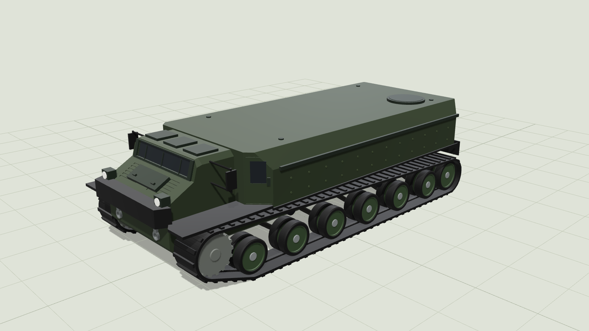

# Patria TRACKX, exterior 3D model



An outside-only, full-scale model of the Patria TRACKX, the light tracked
armoured carrier shown at DSEI in September 2025. It is generated from
`build.py` (CadQuery), so every dimension is a number at the top of the file.

| | published | model |
|---|---|---|
| Length | just over 7 m | 7.23 m |
| Width | under 3 m | 3.00 m |
| Height | 2 m to the roof plate | 2.00 m (hatches 2.06 m) |
| Tracks | 56 cm rubber | 56 cm |
| Belly clearance | 55 cm | 55 cm |
| Running gear | front sprocket, rear idler, 6 dual rubber-tyred road wheels and 2 return rollers a side | the same |

## Where the shape comes from

Published numbers set the size. Three reference photos set the shape: the
front on snow, the rear at DSEI, and the front in a forest. Sizes are scaled
off the pictures against the published width, so they are estimates.

**From the photos:**

- **Plan:** a narrow bonnet and cab sit between the two tracks, and a much
  wider troop box sits behind them. The box has sloped upper sides, chamfered
  corners with the crew doors on the forward ones and lights on the rear ones.
- **Front:** a low, wide windscreen with three wipers and a frame; a louvred
  bonnet with a raised centre hatch; headlights at the bonnet corners; a black
  bumper with wing plates over the tracks; tow shackles on the lower plate.
- **Sides and rear:** mirrors on outrigger frames, a rail where the armour
  slopes, rows of armour bolts, guards along the tracks, rear mud flaps, rear
  lights, tow shackles and a rear door hinged on the left.
- **Running gear:** dual road wheels with dished rims and no bolts, chunky
  track cleats.

**Left off:** the roof weapon station, the pintle gun and the drone jammer,
antennas, camouflage and markings, and everything inside.

## Files

Generated into `out/`:

- `trackx.step`: assembly of 25 named, coloured bodies (hull, glass, fittings,
  bolts, bumper, mirrors, lights, tow shackles, rear lights, and for each side
  the track, guide ridge, tyres, rims, hubs, return rollers, sprocket and
  suspension arms)
- `trackx.glb`: the same model for viewers (copied to `viewer/`)
- `trackx_1to1.stl`: one mesh, millimetres, z up
- `trackx_1to43.stl`: the same at 1:43, 168 × 70 × 49 mm, which fits the
  180 mm bed of a Bambu Lab A1 mini. Small parts such as cleats and bolts are
  finer than a 0.4 mm nozzle prints, so expect a soft detail level.

`preview/` holds stills rendered from the viewer.

## Regenerating

```sh
pip install cadquery trimesh
python3 trackx/build.py --scale 43   # any --scale N writes trackx_1toN.stl
npm install three@0.169.0 playwright
node trackx/tools/render.mjs --three node_modules/three   # stills
```

`viewer/index.html` is the interactive viewer (orbit, six views, hide the
tracks to see the hull, hover a part to name it). Serve the `viewer/` folder
over HTTP to open it locally.

Coordinates are millimetres: x forward, y left, z up, ground at z = 0.

## Sources

- [Patria: TRACKX product page](https://www.patriagroup.com/products-and-services/protected-mobility/patria-trackx)
- [Patria: TRACKX launched at DSEI UK](https://www.patriagroup.com/newsroom/news/2025/patria-trackx-the-ultimate-all-terrain-tracked-vehicle-launched-at-dsei-uk-in-london)
- [Janes: Patria unveils TRACKX](https://www.janes.com/osint-insights/defence-news/land/dsei-2025-patria-unveils-trackx-tracked-all-terrain-vehicle)
- [Defense News: Patria launches light tracked APC](https://www.defensenews.com/global/europe/2025/09/09/finlands-patria-launches-light-tracked-apc-as-successor-to-m113/)
- [EDR Magazine: the FAMOUS concept vehicle it grew out of](https://www.edrmagazine.eu/patria-unveils-the-famous-concept-vehicle)
- Three reference photos supplied by the requester (not stored in the repository)
